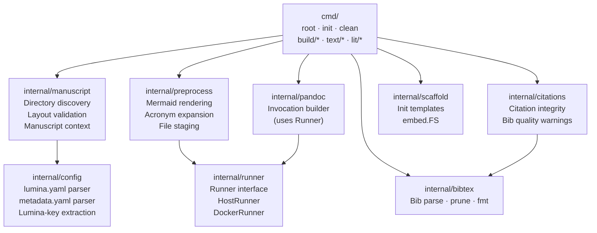
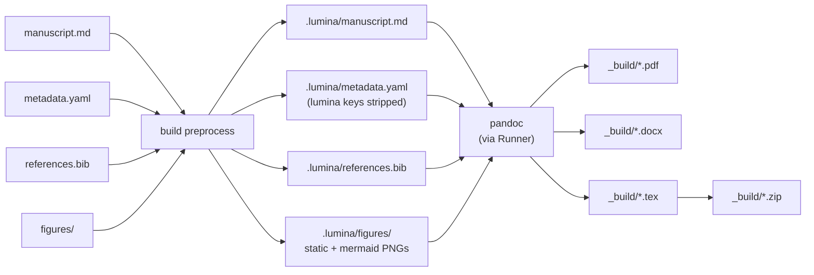

# SDD Spec: Lumina — Academic Writing CLI

## Metadata

* **Status:** `IMPLEMENTED`
* **Author:** Antigravity (agent)
* **Created:** 2026-07-08
* **Last Updated:** 2026-07-08
* **Approver:** Konstantin Sharlaimov

---

## Phase 1: Proposal (Rough Idea)

### 1.1 Problem Statement

Academic writing in Markdown with Pandoc requires a non-trivial build pipeline:
Mermaid preprocessing, citation integrity checking, bibliography pruning and
formatting, prose linting, word-count enforcement, format conversion (PDF, DOCX,
TeX, ZIP), and pre-submission validation gates. Today this pipeline lives in a
monolithic root `Makefile` that is tightly coupled to a single repository
layout (`papers/<module>/`). The build is driven via a collection of `make`
targets that must be invoked with `SRC=<module>` parameters, Docker is
transparently forwarded, and a Go helper binary (`papertool`) handles the
language-aware operations.

The coupling between the Makefile and a fixed directory layout makes it
impossible to use the tooling for a manuscript that lives in its own standalone
directory (e.g., a thesis, a journal article in a dedicated git repo). The
user must either copy the entire `academic_markdown` repo structure or forego
the automation entirely.

The cost of doing nothing: every new manuscript project requires manual
boilerplate setup, ad-hoc shell scripts, or re-cloning the monorepo. The
tooling is not reusable as a standalone tool.

### 1.2 Proposed Solution

Extract the pipeline into a standalone CLI binary named **lumina**, installed
once on the machine (or inside a container). Lumina is invoked from within a
manuscript directory and manages:

* **Internal intermediate state** in a hidden `.lumina/` subdirectory
  (preprocessed Markdown, rendered Mermaid PNGs, cached word counts, etc.)
* **Build artifacts** (PDF, DOCX, TeX, ZIP) in a `_build/` subdirectory
* **User-provided inputs** from conventional locations:
  `literature/` (PDF library with per-file BibTeX sidecars), `figures/` (static images)

All operations that were `make` targets become subcommands of `lumina`:
`lumina build`, `lumina pdf`, `lumina lint`, `lumina wordcount`, etc.
The binary is self-contained: no Makefile, no Docker requirement baked in
(Docker can still be an optional execution environment).

The Go codebase starts from the existing `papertool` implementation in
`academic_markdown/tool/` and is evolved into the new standalone module.

### 1.3 Scope & Requirements

#### In Scope

* New standalone Go module `lumina` located at `/home/ksharlaimov/dev/lumina`.
* All existing `papertool` functionality migrated and reorganised under the
  two-level command hierarchy.
* Two-level command structure — `lumina <group> <subcommand>`:
  * `lumina init` — scaffold (top-level, no group)
  * `lumina clean` — remove generated dirs (top-level)
  * `lumina build [pdf|docx|tex|zip|all|preprocess|pub]` — compilation
  * `lumina text [lint|fmt|words]` — prose quality
  * `lumina lit [check|prune|fmt]` — bibliography / literature
* Manuscript-directory-centric invocation: lumina is called from the
  manuscript root; all paths are resolved relative to CWD.
* Conventional directory layout (all paths relative to manuscript root):
  * `manuscript.md` — **the** manuscript source file. Pure prose; no YAML
    frontmatter. Only accepted name; lumina fails fast if absent.
  * `metadata.yaml` — all manuscript and rendering metadata. Two logical
    groups of keys (see below). Passed to pandoc via `--metadata-file`.
  * `references.bib` — BibTeX citation database. Single file; the only
    source consulted by `check-citations`, `prune-bib`, and the build.
  * `literature/` — user-managed literature library. Each entry is a PDF
    with a same-stem BibTeX sidecar (e.g. `smith2024.pdf` +
    `smith2024.bib`). Lumina treats this directory as read-only.
    Future tooling (separate spec) will import sidecar entries into
    `references.bib` on demand.
  * `figures/` — static images, diagrams, and other graphical artifacts
    to be included in the rendered paper.
  * `.lumina/` — intermediate state managed by lumina: preprocessed
    Markdown, rendered Mermaid PNGs, word-count cache. Not committed.
  * `_build/` — final artifacts (PDF, DOCX, TeX, ZIP). Not committed.
* `metadata.yaml` key groups:
  * **Pandoc-standard keys** — passed verbatim to pandoc via
    `--metadata-file`: `title`, `author`, `date`, `bibliography`,
    `csl`, `numbersections`, `geometry`, `linestretch`, `toc`,
    `lof`, `lot`, and any other pandoc metadata keys.
  * **Lumina-specific keys** — consumed by lumina, not forwarded to pandoc:
    `wordlimit` (integer, word cap enforced by `release`).
  * **Reshaped-and-forwarded keys** — not lumina-specific, but lumina
    massages their shape before forwarding: `acronyms` (author writes
    `KEY: "definition"`; lumina reshapes to pandoc-acro's
    `KEY: {short: KEY, long: "definition"}` schema; the `pandoc-acro`
    filter expands `+KEY` references in the body at build time).
* CSL files resolved from a shared location (XDG config dir or bundled
  defaults) rather than a repo-relative directory.
* `lumina init` — scaffold a new manuscript directory: creates
  `manuscript.md` (pure prose starter, no frontmatter), `metadata.yaml`
  (with commented-out starter keys), empty `references.bib`, `literature/`
  and `figures/` subdirectories, a default `.vale.ini`, and a `.gitignore`
  covering `.lumina/` and `_build/`.
* `lumina build pub`: citation check + lint + wordcount gate + TODO scan,
  then builds dated PDF and ZIP artifacts.
* Prose linting via Vale; `.vale.ini` discovered in manuscript root.
* Tool configuration file `lumina.yaml` in the manuscript root — environment
  and tool settings only (not manuscript metadata). Recognised keys:
  - `pdf-engine` — PDF engine passed to pandoc (default: `xelatex`).
  - `formats` — list of formats built by `lumina build all`
    (default: `[pdf, docx, tex, zip]`).
  - `runner` — where external tools execute: `host` (default) or `docker`.
  - `tools-image` — Docker image name used when `runner: docker`
    (default: `lumina-tools:latest`).
  All keys are optional; lumina supplies sensible defaults.
* **Tool runner abstraction**: lumina never invokes external tools directly.
  All tool calls go through a `Runner` interface with two implementations:
  - `HostRunner` — executes tools directly on the host via `exec.Command`.
  - `DockerRunner` — wraps each tool call as `docker run --rm -v
    <root>:/workspace -w /workspace <tools-image> <tool> <args>`.
  The manuscript root is always mounted at `/workspace`; all paths passed
  to tools are relative to `/workspace`.
* **Lumina repo `Makefile`** (at `/home/ksharlaimov/dev/lumina`) manages
  the development lifecycle of lumina itself:
  - `make` / `make build` — compile the `lumina` Go binary.
  - `make image` — build the `lumina-tools:latest` Docker image containing
    all required external tools (pandoc, pandoc-crossref, pandoc-acro, mmdc,
    vale, prettier, TeX Live, zip).
  - `make install` — install the lumina binary to `/usr/local/bin`.
  Lumina does not build or manage the tools image at runtime.

#### Out of Scope

* GUI or web interface (possible future spec).
* Zotero / Better BibTeX live sync (IDEAS.md item 2; separate spec).
* LanguageTool grammar checking (IDEAS.md item 3; separate spec).
* `latexdiff` revision diffs (IDEAS.md item 4; separate spec).
* Executed plot blocks / `pandoc-plot` (IDEAS.md item 6; separate spec).
* Slides output (IDEAS.md item 17; separate spec).
* Supervisor DOCX round-trip (IDEAS.md item 15; separate spec).
* DOI-to-BibTeX fetch — separate spec.
* Writing velocity / git-history word count tracking — separate spec.
* Multi-manuscript monorepo management (the old Makefile's global targets
  over `papers/*/`); lumina is per-manuscript.

---

### 1.4 Subcommand Reference

All commands are invoked as `lumina <group> <subcommand> [flags]` from within
a manuscript directory. Top-level commands (`init`, `clean`) have no group.
All commands except `init` require `manuscript.md` to be present and fail
fast with a clear error otherwise.

---

#### `lumina init`

Scaffolds a new manuscript directory in CWD. Safe to run in an empty directory
or an existing one — does not overwrite existing files.

Creates:
- `manuscript.md` — pure prose starter (no frontmatter); contains only a
  heading and a usage comment directing the author to `metadata.yaml`.
- `metadata.yaml` — starter metadata file with commented-out examples of
  all supported keys (`title`, `author`, `date`, `bibliography`, `csl`,
  `numbersections`, `wordlimit`, `acronyms`).
- `references.bib` — empty BibTeX file.
- `literature/` — empty directory (with a `.gitkeep`).
- `figures/` — empty directory (with a `.gitkeep`).
- `.vale.ini` — default Vale configuration enabling `write-good` and
  `proselint` packages.
- `.gitignore` — ignores `.lumina/` and `_build/`.

---

#### `lumina clean`

Removes all lumina-managed generated content.

- Deletes `.lumina/` entirely (intermediate state, Mermaid PNG cache).
- Deletes `_build/` entirely (all compiled artifacts).

Does not touch `manuscript.md`, `metadata.yaml`, `references.bib`,
`figures/`, or `literature/`.

---

### `lumina build` — Compilation group

#### `lumina build preprocess`

Reads `manuscript.md` and `metadata.yaml`, writes a preprocessed copy to
`.lumina/manuscript.md`.

Transformations performed:
1. **Mermaid rendering** — finds all ```` ```mermaid ```` fenced code blocks,
   hashes the block source (SHA-256, first 16 hex chars), checks
   `.lumina/figures/mermaid-<hash>.png` for a cached render, renders via
   `mmdc` only on cache miss, replaces the block with a standard image link
   ``.

Acronym expansion (`+KEY` in body text) is **not** performed by lumina.
The `acronyms:` map in `metadata.yaml` is reshaped into pandoc-acro's
`KEY: {short: KEY, long: definition}` schema and forwarded verbatim to
`.lumina/metadata.yaml`; the `pandoc-acro` filter expands `+KEY` at pandoc
build time (see the pandoc invocations below).

Also copies `figures/*` (static) into `.lumina/figures/`, `references.bib`
into `.lumina/references.bib`, and `metadata.yaml` into
`.lumina/metadata.yaml` so the intermediate directory is self-contained.

`--force` flag: re-renders all Mermaid PNGs even if cached.

---

#### `lumina build pdf`

Produces `_build/<manuscript-stem>.pdf`. Runs `build preprocess` first if
intermediate files are absent or stale.

Pandoc invocation: `pandoc .lumina/manuscript.md --metadata-file
.lumina/metadata.yaml --filter pandoc-acro --filter pandoc-crossref --citeproc
--pdf-engine=<engine> -o _build/<stem>.pdf`.

PDF engine defaults to `xelatex`; overridden by `lumina.yaml` `pdf-engine`
or `--pdf-engine` flag. If `publish/template.tex` exists, passed as
`--template`.

---

#### `lumina build docx`

Produces `_build/<manuscript-stem>.docx`. Runs `build preprocess` first if
stale.

Pandoc invocation: adds `--metadata-file .lumina/metadata.yaml --filter
pandoc-acro --filter pandoc-crossref --citeproc`. If `publish/reference.docx`
exists, passed as `--reference-doc`.

---

#### `lumina build tex`

Produces `_build/<manuscript-stem>.tex` — a standalone LaTeX source file.
Runs `build preprocess` first if stale.

Pandoc invocation: adds `-s --metadata-file .lumina/metadata.yaml --filter
pandoc-acro --filter pandoc-crossref --citeproc`.

Useful for Overleaf upload and as input to `lumina build zip`.

---

#### `lumina build zip`

Produces `_build/<manuscript-stem>.zip` — a self-contained submission archive.
Runs `build tex` first if `.tex` is stale.

ZIP contents: `<stem>.tex`, `references.bib`, `figures/` (static + Mermaid
PNGs). Intended for journal/conference portals that accept LaTeX source.

---

#### `lumina build all`

Runs the full build pipeline. Default when no subcommand is given to the
`build` group.

Sequence:
1. `lumina lit check` — abort on failure.
2. `lumina build preprocess`
3. Build each format listed in `lumina.yaml` `formats`
   (default: `pdf docx tex zip`).

Equivalent to the old `SRC=<module> make all`.

---

#### `lumina build pub`

Pre-submission publication gate followed by dated artifact creation. Fails
fast at the first gate that does not pass.

Gates (in order):
1. `lumina lit check` — citation integrity must pass.
2. `lumina text lint` — Vale must report zero errors.
3. `wordlimit` in `metadata.yaml` must not be exceeded (if set).
4. `manuscript.md` must contain no `TODO` or `{.todo}` markers.

If all gates pass:
- Runs `lumina build pdf` and `lumina build zip`.
- Copies to dated files: `_build/<stem>_<YYYY-MM-DD>.pdf` and
  `_build/<stem>_<YYYY-MM-DD>.zip`.
- Prints paths of created artifacts.

---

### `lumina text` — Prose quality group

#### `lumina text lint`

Runs [Vale](https://vale.sh) prose linter on `manuscript.md`.

Uses `.vale.ini` in the manuscript root. On first run, downloads configured
Vale packages via `vale sync` if the `styles/` directory is absent or stale.
Exits non-zero if Vale reports any errors (warnings are printed but do not
fail the command).

---

#### `lumina text fmt`

Formats `manuscript.md` for consistent Markdown style. Does not change
content semantics.

Runs `prettier --write manuscript.md`.

---

#### `lumina text words`

Counts words in `manuscript.md` using `pandoc --to=plain | wc -w` (strips
Markdown syntax before counting; no frontmatter present).

Reports: `<count> words`. If `wordlimit` is set in `metadata.yaml`, reports
`<count> / <limit>` and prints a warning in red if the count exceeds the
limit.

Exits zero regardless — word count over limit is a warning here;
`lumina build pub` is the enforcement gate.

---

### `lumina lit` — Literature & bibliography group

#### `lumina lit check`

Verifies citation integrity between `manuscript.md` and `references.bib`.

Checks:
- Every `@key` cited in `manuscript.md` has a matching entry in
  `references.bib`. Exits non-zero and lists all missing keys on failure.
- **Warnings** (non-fatal): duplicate citation keys, duplicate DOIs,
  duplicate titles, missing required fields per entry type
  (e.g. `author`, `year`, `title` for `@article`).

Does not modify any file.

---

#### `lumina lit prune`

Rewrites `references.bib` **in place**, keeping only entries whose key is
actually cited (`@key`) in `manuscript.md`.

**Destructive.** Not invoked by any other command. Run deliberately before
submission. Prints a summary of removed entries.

---

#### `lumina lit fmt`

Formats `references.bib` in place for consistent style. Does not remove
or add entries.

Actions: sorts fields per entry, normalises whitespace, consistent quoting
convention — equivalent to the old `papertool fmt-bib`.

---

## Phase 2: System Design (SDD)

* **Status updated:** `DESIGN`
* **Last Updated:** 2026-07-08

### 2.1 Architecture & Components

Lumina is a native host binary. The CLI layer (Cobra commands) is thin:
it resolves the manuscript context and delegates all logic to internal
packages. All external tool calls go through a `Runner` interface; no
tool is invoked directly from command code.



**Build pipeline data flow:**



---

### 2.2 Go Package Layout

```
lumina/
├── main.go
├── go.mod                          module: lumina
├── Makefile                        build · image · install targets
├── Dockerfile                      lumina-tools image (tools only, not lumina binary)
├── cmd/
│   ├── root.go                     rootCmd, Execute()
│   ├── init.go                     lumina init
│   ├── clean.go                    lumina clean
│   ├── build/
│   │   ├── build.go                buildCmd parent; delegates to all when no subcommand
│   │   ├── preprocess.go           lumina build preprocess
│   │   ├── pdf.go                  lumina build pdf
│   │   ├── docx.go                 lumina build docx
│   │   ├── tex.go                  lumina build tex
│   │   ├── zip.go                  lumina build zip
│   │   ├── all.go                  lumina build all
│   │   └── pub.go                  lumina build pub
│   ├── text/
│   │   ├── text.go                 textCmd parent
│   │   ├── lint.go                 lumina text lint
│   │   ├── fmt.go                  lumina text fmt
│   │   └── words.go                lumina text words
│   └── lit/
│       ├── lit.go                  litCmd parent
│       ├── check.go                lumina lit check
│       ├── prune.go                lumina lit prune
│       └── fmt.go                  lumina lit fmt
├── internal/
│   ├── manuscript/
│   │   └── manuscript.go           Manuscript struct, Load(), validation
│   ├── config/
│   │   └── config.go               Config, LuminaMetadata, load functions
│   ├── runner/
│   │   ├── runner.go               Runner interface, Options
│   │   ├── host.go                 HostRunner
│   │   └── docker.go               DockerRunner
│   ├── preprocess/
│   │   ├── preprocess.go           Run(), IsStale(), Options
│   │   └── mermaid.go              Block detection, mmdc via Runner, cache
│   ├── citations/
│   │   └── citations.go            Check(), Result, Warning
│   ├── bibtex/
│   │   └── bibtex.go               Parse(), Prune(), Format()
│   ├── pandoc/
│   │   └── pandoc.go               Invocation struct, Run() via Runner
│   └── scaffold/
│       ├── scaffold.go             Init(), file creation logic
│       └── templates/              embedded via embed.FS
│           ├── manuscript.md.tmpl
│           ├── metadata.yaml.tmpl
│           ├── gitignore.tmpl
│           └── vale.ini.tmpl
└── spec/
    └── ...
```

`internal/citations` and `internal/bibtex` are direct ports of
`papertool/internal/citations` and the bib logic scattered across
`papertool/cmd/`. The `internal/frontmatter` package from papertool is
**not** ported — its role is subsumed by `internal/config`.

---

### 2.3 Data Structures & Interfaces

#### `internal/runner`

```go
// Runner executes external tool commands either on the host or via Docker.
type Runner interface {
    // Run executes tool with args in the given working directory.
    // stdout and stderr stream to the terminal.
    Run(tool string, args []string, cwd string) error

    // CheckPresent returns an error if tool is not available.
    CheckPresent(tool string) error
}

// HostRunner executes tools directly via exec.Command.
type HostRunner struct{}

// DockerRunner wraps each tool call in `docker run`.
// The manuscript root is mounted at /workspace.
type DockerRunner struct {
    Image string // e.g. "lumina-tools:latest"
    Root  string // absolute path to manuscript root → mounted as /workspace
}
// DockerRunner.Run expands to:
//   docker run --rm -u <uid>:<gid>
//              -v <Root>:/workspace -w /workspace
//              -e HOME=/tmp
//              <Image> <tool> <args...>

// New constructs the appropriate Runner from a loaded Config.
func New(cfg config.Config, manuscriptRoot string) Runner
```

#### `internal/config`

```go
// Config is parsed from lumina.yaml. All fields optional.
type Config struct {
    PDFEngine  string   `yaml:"pdf-engine"`  // default: "xelatex"
    Formats    []string `yaml:"formats"`     // default: ["pdf","docx","tex","zip"]
    Runner     string   `yaml:"runner"`      // "host" (default) | "docker"
    ToolsImage string   `yaml:"tools-image"` // default: "lumina-tools:latest"
}

// LuminaMetadata holds lumina-specific keys from metadata.yaml.
// Stripped before metadata.yaml is copied to .lumina/ for pandoc.
type LuminaMetadata struct {
    WordLimit int `yaml:"wordlimit"` // 0 = unlimited
}

// LoadConfig reads lumina.yaml.
//
// LoadMetadata reads metadata.yaml, strips wordlimit into LuminaMetadata,
// and reshapes acronyms (author-facing `KEY: "definition"`) into
// pandoc-acro's `KEY: {short: KEY, long: "definition"}` schema in the
// returned map — acronyms is forwarded to pandoc, not consumed by lumina.
func LoadConfig(root string) (Config, error)
func LoadMetadata(root string) (LuminaMetadata, map[string]any, error)
```

#### `internal/manuscript`

```go
// Manuscript is the resolved context for one lumina invocation.
type Manuscript struct {
    Root      string               // absolute path to manuscript directory (CWD)
    Source    string               // Root/manuscript.md
    LuminaDir string               // Root/.lumina
    BuildDir  string               // Root/_build
    Stem      string               // always "manuscript"
    Config    config.Config
    Meta      config.LuminaMetadata
    Runner    runner.Runner        // constructed from Config
}

// Load resolves the Manuscript from CWD. Errors if manuscript.md absent.
func Load() (*Manuscript, error)

func (m *Manuscript) IntermediateSource() string  // .lumina/manuscript.md
func (m *Manuscript) IntermediateMeta() string    // .lumina/metadata.yaml
func (m *Manuscript) BuildPath(ext string) string // _build/manuscript.<ext>
```

#### `internal/preprocess`

```go
type Options struct {
    Force bool // invalidate Mermaid PNG cache; re-render all
}

// Run preprocesses manuscript.md → .lumina/manuscript.md.
// Also stages figures, references.bib, and cleaned metadata.yaml.
// Idempotent; skips if not stale and Force is false.
func Run(ms *manuscript.Manuscript, opts Options) error

// IsStale reports whether .lumina/manuscript.md needs regeneration.
// Stale if absent or if manuscript.md / metadata.yaml / figures/* are newer.
func IsStale(ms *manuscript.Manuscript) (bool, error)
```

Mermaid cache key: `SHA-256(block source)[0:16]`.
Cache location: `.lumina/figures/mermaid-<hash>.png`.
`mmdc` is invoked via `ms.Runner`.

#### `internal/pandoc`

```go
// Invocation describes one pandoc execution.
type Invocation struct {
    Input        string   // .lumina/manuscript.md
    MetadataFile string   // .lumina/metadata.yaml
    Output       string   // _build/manuscript.<ext>
    Filters      []string // ["pandoc-acro", "pandoc-crossref"]
    ExtraFlags   []string // ["-s", "--pdf-engine=xelatex", ...]
    Template     string   // --template; empty = omit
    ReferenceDoc string   // --reference-doc; empty = omit
}

// Run executes pandoc via ms.Runner.
func (inv *Invocation) Run(ms *manuscript.Manuscript) error
```

When `DockerRunner` is active, all paths are rewritten relative to
`/workspace` before being passed to pandoc inside the container.

#### `internal/citations`

```go
type Result struct {
    Missing  []string  // @keys in manuscript with no bib entry → fatal
    Warnings []Warning // quality issues → non-fatal
}

type Warning struct {
    Kind    string // "duplicate-key"|"duplicate-doi"|"duplicate-title"|"missing-field"
    Message string
}

func Check(ms *manuscript.Manuscript) (Result, error)
```

#### `internal/bibtex`

```go
func Parse(path string) ([]Entry, error)
func Prune(path string, cited []string) (removed int, err error)
func Format(path string) error

type Entry struct {
    Key    string
    Type   string
    Fields map[string]string
}
```

---

### 2.4 Cobra Command Tree

```
rootCmd  "lumina"
  (no --docker flag)

  initCmd   "init"

  cleanCmd  "clean"

  buildCmd  "build"  RunE: delegate to allCmd when called without subcommand
    preprocessCmd  "preprocess"
      --force  bool
    pdfCmd    "pdf"
      --pdf-engine  string
      --force       bool
    docxCmd   "docx"
      --force  bool
    texCmd    "tex"
      --force  bool
    zipCmd    "zip"
      --force  bool
    allCmd    "all"
      --force  bool
    pubCmd    "pub"

  textCmd  "text"
    lintCmd   "lint"
    fmtCmd    "fmt"
    wordsCmd  "words"

  litCmd   "lit"
    checkCmd  "check"
    pruneCmd  "prune"
    litFmtCmd "fmt"
```

`manuscript.Load()` is called in each leaf command's `RunE` — not in a
parent `PersistentPreRunE` — so that `lumina init` runs in an empty
directory without triggering the presence check.

The `Runner` is constructed inside `manuscript.Load()` from the loaded
`Config`, then attached to the `Manuscript` struct and threaded to all
packages that need it.

---

### 2.5 Protocol / API Changes

#### Pandoc invocations

All builds operate on `.lumina/manuscript.md`. Working directory for pandoc
is the manuscript root (or `/workspace` inside Docker). Paths in metadata
(e.g. `csl:`, `bibliography:`) must therefore be relative to the manuscript
root.

| Format | Key pandoc flags |
|--------|------------------|
| `pdf`  | `--metadata-file .lumina/metadata.yaml --filter pandoc-acro --filter pandoc-crossref --citeproc --pdf-engine=<engine> [--template publish/template.tex]` |
| `docx` | `--metadata-file .lumina/metadata.yaml --filter pandoc-acro --filter pandoc-crossref --citeproc [--reference-doc publish/reference.docx]` |
| `tex`  | `--metadata-file .lumina/metadata.yaml --filter pandoc-acro --filter pandoc-crossref --citeproc -s [--template publish/template.tex]` |
| `zip`  | depends on `tex`; `zip -r` over `.tex`, `references.bib`, `figures/` |

Word count: `pandoc manuscript.md --to=plain --quiet` piped to `wc -w`.
Operates on the source file directly; runs through the configured Runner.

#### `metadata.yaml` key contract

Lumina strips `wordlimit` before writing `.lumina/metadata.yaml`. `acronyms`
is reshaped from the author-facing `KEY: "definition"` form into
pandoc-acro's `KEY: {short: KEY, long: "definition"}` schema and forwarded —
it is consumed by the `pandoc-acro` filter at build time, not by lumina.
All other keys forwarded verbatim.

#### `lumina.yaml` schema (complete)

```yaml
# lumina.yaml — tool configuration. All keys optional.
pdf-engine:  xelatex                # pandoc --pdf-engine value
formats:                            # formats built by "lumina build all"
  - pdf
  - docx
  - tex
  - zip
runner:      host                   # host | docker
tools-image: lumina-tools:latest    # used when runner: docker
```

#### `metadata.yaml` starter schema

```yaml
# metadata.yaml — manuscript metadata.
title:          "Untitled Manuscript"
author:         "Author Name"
date:           "2026-07-08"
bibliography:   "references.bib"
csl:            "ieee.csl"
numbersections: true

# lumina-specific (not forwarded to pandoc):
wordlimit:  0         # 0 = no limit
acronyms:   {}        # KEY: "full definition"
```

#### DockerRunner invocation pattern

```
docker run --rm \
  -u <uid>:<gid> \
  -v <manuscript-root>:/workspace \
  -w /workspace \
  -e HOME=/tmp \
  <tools-image> \
  <tool> <args...>
```

One `docker run` per tool invocation. The container is stateless; no
long-running container or exec is used.

#### Makefile targets (lumina repo)

| Target | Action |
|--------|--------|
| `make` / `make build` | Compile `lumina` binary to `./lumina` |
| `make image` | Build `lumina-tools:latest` Docker image (tools only) |
| `make install` | Copy binary to `/usr/local/bin/lumina` |
| `make test` | Run `go test ./...` |
| `make vet` | Run `go vet ./...` |

#### External tool version requirements

| Tool | Minimum | Required by |
|------|---------|-------------|
| `pandoc` | 3.0 | `build pdf/docx/tex`, `text words` |
| `pandoc-crossref` | matches pandoc | `build pdf/docx/tex` |
| `pandoc-acro` | any | `build pdf/docx/tex` |
| `mmdc` | 10.0 | `build preprocess` |
| `vale` | 3.0 | `text lint` |
| `prettier` | 3.0 | `text fmt` |
| TeX engine | TeX Live 2023 | `build pdf` |
| `zip` | any | `build zip` |

Each command checks required tools via `Runner.CheckPresent()` before
running. Failure prints the missing binary name and a one-line hint.

---

### 2.6 Real-Time & Resource Impacts

* **Mermaid rendering** — heaviest operation; spawns headless Chromium
  via `mmdc`. Cached per source hash; re-runs hit cache for unchanged
  diagrams. One `docker run` per uncached diagram when using DockerRunner.
* **Pandoc** — ≈3–10 s for a typical MSc paper to PDF. Acceptable.
* **DockerRunner overhead** — one `docker run` cold-start per tool call;
  ≈0.3–1 s per invocation on a warm daemon. Acceptable for batch builds;
  not suitable for interactive word-count checks (use HostRunner for speed).
* **Go allocations** — all lumina logic is I/O-bound; no allocation
  constraints apply.
* **Concurrency** — single-threaded per invocation; formats in
  `lumina build all` are built sequentially. Parallelism deferred.
* **Binary size** — estimated ≈10 MB including embedded templates.
* **No network access** at runtime. `vale sync` is the only network
  operation; explicitly user-triggered on first lint run.

---

## Phase 3: Implementation Plan (IP)

### 3.1 Task Breakdown

Tasks execute in strict order. Each task includes its own unit tests.
All verification commands run from the lumina repo root unless noted.

---

- [ ] **Task 1: Module skeleton + Makefile**
  - **Files:** `go.mod`, `main.go`, `Makefile`, `cmd/root.go`,
    directory stubs for all packages (empty `doc.go` per package)
  - **Action:** Initialise Go module `lumina`. Wire `rootCmd` with
    `Short` description. Add Makefile targets: `build` (`go build -o
    lumina .`), `test` (`go test ./...`), `vet` (`go vet ./...`),
    `install` (`cp lumina /usr/local/bin/lumina`).
  - **Verification:** `make vet && make test && make build && ./lumina --help`

---

- [ ] **Task 2: `internal/config`**
  - **Files:** `internal/config/config.go`,
    `internal/config/config_test.go`
  - **Action:** Implement `Config`, `LuminaMetadata`, `LoadConfig()`,
    `LoadMetadata()`. `LoadMetadata` splits the raw YAML map into
    `LuminaMetadata` (extracting `wordlimit` and `acronyms`) and a
    cleaned `map[string]any` with those keys removed (for pandoc).
    Returns zero values with no error when files are absent.
  - **Verification:** `go test ./internal/config/...`

---

- [ ] **Task 3: `internal/runner` — HostRunner**
  - **Files:** `internal/runner/runner.go`, `internal/runner/host.go`,
    `internal/runner/runner_test.go`
  - **Action:** Define `Runner` interface (`Run`, `CheckPresent`).
    Implement `HostRunner`: `Run` uses `exec.Command`, streams stdout
    and stderr to `os.Stdout`/`os.Stderr`. `CheckPresent` uses
    `exec.LookPath`.
  - **Verification:** `go test ./internal/runner/...`

---

- [ ] **Task 4: `internal/runner` — DockerRunner**
  - **Files:** `internal/runner/docker.go`
    (tests in `internal/runner/runner_test.go`)
  - **Action:** Implement `DockerRunner`. `Run` constructs and executes:
    `docker run --rm -u <uid>:<gid> -v <Root>:/workspace -w /workspace
    -e HOME=/tmp <Image> <tool> <args…>`. Paths in `args` that are
    absolute and rooted under `Root` are rewritten to `/workspace/…`
    before the call. `CheckPresent` checks that `docker` is on PATH and
    that the configured image exists (`docker image inspect`).
    `runner.New(cfg, root)` returns the appropriate implementation.
  - **Verification:** `go test ./internal/runner/...`

---

- [ ] **Task 5: `internal/manuscript`**
  - **Files:** `internal/manuscript/manuscript.go`,
    `internal/manuscript/manuscript_test.go`
  - **Action:** Implement `Manuscript`, `Load()`. `Load` resolves CWD,
    checks for `manuscript.md`, calls `config.LoadConfig` and
    `config.LoadMetadata`, constructs `Runner` via `runner.New`.
    Returns a typed error (`ErrNoManuscript`) when `manuscript.md` is
    absent — commands print: `"no manuscript.md found — run 'lumina
    init' to create one"`. Implement helper methods
    `IntermediateSource()`, `IntermediateMeta()`, `BuildPath(ext)`.
  - **Verification:** `go test ./internal/manuscript/...`

---

- [ ] **Task 6: `internal/scaffold` + embedded templates**
  - **Files:** `internal/scaffold/scaffold.go`,
    `internal/scaffold/templates/manuscript.md.tmpl`,
    `internal/scaffold/templates/metadata.yaml.tmpl`,
    `internal/scaffold/templates/gitignore.tmpl`,
    `internal/scaffold/templates/vale.ini.tmpl`,
    `internal/scaffold/scaffold_test.go`
  - **Action:** Embed templates via `//go:embed templates/*`. Implement
    `Init(root string) error` — creates each file only if absent (never
    overwrites). Creates `literature/` and `figures/` with `.gitkeep`.
    Prints a summary of created files.
  - **Verification:** `go test ./internal/scaffold/...`

---

- [ ] **Task 7: `cmd/init` + `cmd/clean`**
  - **Files:** `cmd/init.go`, `cmd/clean.go`
  - **Action:** `initCmd.RunE` calls `scaffold.Init(cwd)`. Does **not**
    call `manuscript.Load()`. `cleanCmd.RunE` calls `manuscript.Load()`,
    then removes `.lumina/` and `_build/` with `os.RemoveAll`; prints
    what was removed.
  - **Verification:** `make build && ./lumina init` in a temp dir;
    verify expected files created. `./lumina clean` removes only managed
    dirs.

---

- [ ] **Task 8: `internal/bibtex`**
  - **Files:** `internal/bibtex/bibtex.go`,
    `internal/bibtex/bibtex_test.go`,
    `internal/bibtex/testdata/*.bib`
  - **Action:** Port `Parse`, `Prune`, `Format` from
    `papertool/cmd/fmtbib.go` and `papertool/cmd/prunebib.go` and
    `papertool/internal/citations/`. Adjust package structure; add unit
    tests covering edge cases (empty bib, duplicate keys, unicode
    authors).
  - **Verification:** `go test ./internal/bibtex/...`

---

- [ ] **Task 9: `internal/citations`**
  - **Files:** `internal/citations/citations.go`,
    `internal/citations/citations_test.go`,
    `internal/citations/testdata/`
  - **Action:** Port citation-checking logic from
    `papertool/cmd/checkcitations.go` and
    `papertool/internal/citations/`. Uses `internal/bibtex.Parse` for
    bib parsing; uses Goldmark AST walk (already a dependency) to
    extract `@key` references from `manuscript.md`. Returns `Result`
    with `Missing` and `Warnings`.
  - **Verification:** `go test ./internal/citations/...`

---

- [ ] **Task 10: `cmd/lit` — check, prune, fmt**
  - **Files:** `cmd/lit/lit.go`, `cmd/lit/check.go`,
    `cmd/lit/prune.go`, `cmd/lit/fmt.go`
  - **Action:** Wire up the three `lit` subcommands. Each calls
    `manuscript.Load()` then the relevant internal function.
    `lit check` exits 1 on missing citations, 0 with warnings printed.
    `lit prune` prompts for confirmation (`--yes` flag skips prompt).
    `lit fmt` formats in-place.
  - **Verification:** `make build && ./lumina lit check` against
    `testdata/sample/`; `./lumina lit prune --yes`; `./lumina lit fmt`

---

- [ ] **Task 11: `internal/preprocess` — acronym expansion**
  - **Files:** `internal/preprocess/acronym.go`,
    `internal/preprocess/acronym_test.go`
  - **Action:** Port acronym expansion from `papertool/cmd/preprocess.go`
    (`runPreprocess` acronym section). Reads `acronyms` map from
    `LuminaMetadata` (not from frontmatter). Goldmark AST walk; skips
    code spans, code blocks, HTML blocks. Returns a list of `replacement`
    structs (byte-range + text).
  - **Verification:** `go test ./internal/preprocess/...`

---

- [ ] **Task 12: `internal/preprocess` — Mermaid rendering**
  - **Files:** `internal/preprocess/mermaid.go`
    (tests in `internal/preprocess/`)
  - **Action:** Port Mermaid block detection and `mmdc` invocation from
    `papertool/cmd/preprocess.go`. `mmdc` invoked via `ms.Runner` (not
    `exec.Command` directly). Cache check: skip render if
    `.lumina/figures/mermaid-<hash>.png` exists and `Force` is false.
    Puppeteer config JSON (no-sandbox flags) written to a temp file as
    in papertool.
  - **Verification:** `go test ./internal/preprocess/...`

---

- [ ] **Task 13: `internal/preprocess` — Run, IsStale, file staging**
  - **Files:** `internal/preprocess/preprocess.go`
    (tests in `internal/preprocess/`)
  - **Action:** Implement `IsStale` (compares mtimes of source files
    against `.lumina/manuscript.md`). Implement `Run`: apply acronym
    and Mermaid replacements to produce `.lumina/manuscript.md`; copy
    `figures/*` to `.lumina/figures/`; copy `references.bib` to
    `.lumina/references.bib`; write cleaned `metadata.yaml` (lumina
    keys stripped) to `.lumina/metadata.yaml`. Create `.lumina/`
    subdirectories as needed.
  - **Verification:** `go test ./internal/preprocess/...`

---

- [ ] **Task 14: `cmd/build preprocess`**
  - **Files:** `cmd/build/build.go`, `cmd/build/preprocess.go`
  - **Action:** Wire `buildCmd` parent (registers subcommands; its
    `RunE` delegates to `allCmd.RunE` when invoked with no args). Wire
    `preprocessCmd` with `--force` flag calling `preprocess.Run`.
  - **Verification:** `make build && ./lumina build preprocess` against
    `testdata/sample/`; inspect `.lumina/` output.

---

- [ ] **Task 15: `internal/pandoc`**
  - **Files:** `internal/pandoc/pandoc.go`,
    `internal/pandoc/pandoc_test.go`
  - **Action:** Implement `Invocation`, `Run(ms)`. Constructs the
    pandoc argument list from struct fields. When `ms.Runner` is a
    `DockerRunner`, rewrites `Input`, `MetadataFile`, `Output`,
    `Template`, `ReferenceDoc` paths to `/workspace/`-relative before
    passing to `ms.Runner.Run`. Checks `pandoc` and filter presence via
    `ms.Runner.CheckPresent` before running.
  - **Verification:** `go test ./internal/pandoc/...`

---

- [ ] **Task 16: `cmd/build pdf`, `docx`, `tex`**
  - **Files:** `cmd/build/pdf.go`, `cmd/build/docx.go`,
    `cmd/build/tex.go`
  - **Action:** Each command calls `manuscript.Load()`, runs
    `preprocess.Run` if stale (or `--force`), constructs the
    appropriate `pandoc.Invocation` (per §2.5 table), creates
    `_build/` if absent, calls `inv.Run(ms)`. `pdf` checks for
    `publish/template.tex`; `docx` checks for
    `publish/reference.docx`.
  - **Verification:** `make build && ./lumina build pdf` against
    `testdata/sample/`; verify `_build/manuscript.pdf` produced.
    Repeat for `docx` and `tex`.

---

- [ ] **Task 17: `cmd/build zip`**
  - **Files:** `cmd/build/zip.go`
  - **Action:** Ensures `_build/manuscript.tex` is current (calls
    `texCmd.RunE` if stale). Copies `.tex` into `.lumina/` staging
    area, invokes `zip -r _build/manuscript.zip manuscript.tex
    references.bib figures/` via `ms.Runner` from `.lumina/`.
  - **Verification:** `./lumina build zip`; verify archive contents
    with `unzip -l _build/manuscript.zip`.

---

- [ ] **Task 18: `cmd/build all` + default behaviour**
  - **Files:** `cmd/build/all.go`
  - **Action:** `allCmd.RunE`: call `citations.Check(ms)` — exit 1 if
    `Missing` non-empty; call `preprocess.Run`; iterate `ms.Config.Formats`
    invoking the appropriate sub-command `RunE`. `buildCmd.RunE` is set
    to `allCmd.RunE` so `lumina build` (no subcommand) runs `all`.
  - **Verification:** `./lumina build all`; verify all four artifacts
    in `_build/`. `./lumina build` (no subcommand) produces same result.

---

- [ ] **Task 19: `cmd/build pub`**
  - **Files:** `cmd/build/pub.go`
  - **Action:** Sequential gates (fail-fast):
    1. `citations.Check` — exit 1 if missing keys.
    2. `vale` via `ms.Runner` — exit 1 if non-zero exit.
    3. Word count via pandoc plain output, parsed in Go
       (`strings.Fields`); exit 1 if over `ms.Meta.WordLimit` (skip if
       0).
    4. Scan `manuscript.md` for `TODO` or `{.todo}`; exit 1 if found.
    Gates pass → `lumina build pdf` + `lumina build zip` → copy to
    `_build/<stem>_<YYYY-MM-DD>.{pdf,zip}`.
  - **Verification:** `./lumina build pub` against `testdata/sample/`
    (clean manuscript); verify dated artifacts. Introduce a TODO, verify
    failure.

---

- [ ] **Task 20: `cmd/text` — words, fmt, lint**
  - **Files:** `cmd/text/text.go`, `cmd/text/words.go`,
    `cmd/text/fmt.go`, `cmd/text/lint.go`
  - **Action:**
    - `words`: pandoc `manuscript.md --to=plain --quiet` via Runner,
      read stdout, count with `strings.Fields`. Print count (and
      `count / limit` if limit set).
    - `fmt`: invoke `prettier --write manuscript.md` via Runner.
    - `lint`: invoke `vale` via Runner with `.vale.ini` in CWD. If
      `styles/` absent, run `vale sync` first.
  - **Verification:** `./lumina text words`; `./lumina text fmt`;
    `./lumina text lint` against `testdata/sample/`.

---

- [ ] **Task 21: `testdata/sample/` — integration test fixture**
  - **Files:** `testdata/sample/manuscript.md`,
    `testdata/sample/metadata.yaml`,
    `testdata/sample/references.bib`,
    `testdata/sample/figures/diagram.png`,
    `testdata/sample/literature/.gitkeep`
  - **Action:** Create a minimal but realistic sample manuscript: ~300
    words, one Mermaid diagram, two citations, one acronym, one figure,
    word limit set to 500. Used as the target for all smoke-test
    verifications above and a `go test` integration test.
  - **Verification:** `go test ./... -tags=integration` (integration
    tag gates tests that invoke external tools).

---

- [ ] **Task 22: Dockerfile for `lumina-tools` image**
  - **Files:** `Dockerfile`
  - **Action:** Multi-stage or single-stage image based on a Debian/Ubuntu
    slim base. Installs: `pandoc` (matching version pin), `pandoc-crossref`,
    Node.js + `npm`, `@mermaid-js/mermaid-cli`, `prettier`, TeX Live
    (minimal + `xelatex`), `vale`, `zip`. Does **not** include the
    `lumina` binary. Sets `WORKDIR /workspace`. Add `make image` target
    to Makefile: `docker build -t lumina-tools:latest .`.
  - **Verification:** `make image && docker run --rm lumina-tools:latest
    pandoc --version`; smoke-test each required tool.

---

- [ ] **Task 23: End-to-end integration verification**
  - **Files:** no new files; uses `testdata/sample/`
  - **Action:** Full run against `testdata/sample/` with both runners:
    1. HostRunner: `./lumina build all` (requires tools on host or skip
       in CI).
    2. DockerRunner: set `runner: docker` in `testdata/sample/lumina.yaml`;
       `./lumina build all` — verify all four artifacts produced inside
       Docker.
    3. `./lumina build pub` — clean manuscript, verify dated artifacts.
    4. `./lumina lit check`, `./lumina text words`, `./lumina text lint`.
    5. `./lumina clean` — verify `.lumina/` and `_build/` removed.
  - **Verification:** all above produce expected artifacts; `make vet &&
    make test` passes clean.

---

### 3.2 Risks & Mitigation

| Risk | Likelihood | Mitigation |
|------|-----------|------------|
| DockerRunner path rewriting misses an edge case (symlinks, spaces in path) | Medium | Unit-test `DockerRunner` path rewriting with table-driven cases covering spaces, symlinks, and paths outside `Root` |
| `mmdc` Chromium sandbox restrictions inside Docker | High (known) | Carry over puppeteer no-sandbox config JSON from papertool (already solved there) |
| Cobra `build` default-to-`all` behaves unexpectedly with flags | Low | Set `buildCmd.DisableFlagParsing = false`; test `./lumina build --force` explicitly |
| `vale sync` network call in test environment | Medium | Skip `vale sync` in tests via `--no-exit` flag or by pre-seeding `styles/` in `testdata/sample/` |
| Word count via pandoc plain output differs from papertool baseline | Low | Run both against `testdata/sample/` in Task 21 and assert counts agree |
| Go module name clash with existing `papertool` dependency aliases | Low | Use `module lumina` (no subdomain); internal packages use `lumina/internal/…` |

---

---

## Phase 4: Execution & Verification

- [x] All per-task verification steps pass.
- [x] Linter / vet clean.
- [x] Unit tests pass.
- [x] Build targets compile.
- [x] Neighbor packages unaffected.
- [ ] Approved by the User.

---

## Phase 5: Completed

- [x] All Phase 4 items `[x]`.
- [x] No regressions.
- [x] Spec document reflects actual implementation.
- [x] `spec/README.md` updated to `COMPLETED`.
- [ ] Approved by the User.
