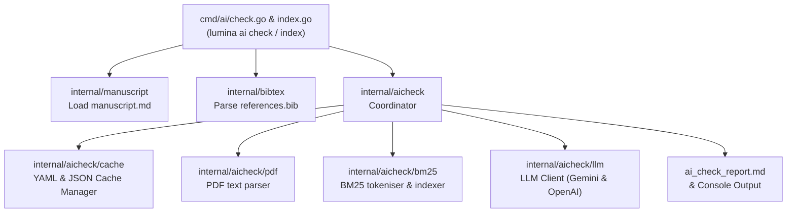

# SDD Spec: AI-Assisted Prose and Literature Cross-Checking

## Metadata
* **Status:** `COMPLETED`
* **Author:** Antigravity (agent)
* **Created:** 2026-07-08
* **Last Updated:** 2026-07-09
* **Approver:** Konstantin Sharlaimov

---

## Phase 1: Proposal (Rough Idea)

### 1.1 Problem Statement

Academic writing requires rigorous attribution. Authors frequently face two distinct challenges:
1. **Uncited Assertions**: Stating facts, numbers, or unique claims without citing supporting literature. This leads to peer-review rejection or academic integrity issues.
2. **Citation Misalignment (Hallucinations/Misrepresentation)**: Citing a paper for a claim it does not actually make, or misinterpreting the cited authors' findings.

Currently, detecting these issues requires meticulous manual reading by the author, supervisors, or peer reviewers. If a citation is incorrect or a claim is unsupported, this is often only discovered late in the publishing cycle.

The cost of doing nothing: higher rates of manuscript rejection, accidental academic dishonesty, and significant human effort spent verification-reading papers.

### 1.2 Proposed Solution

Introduce a new command group `lumina ai` with subcommands `check` and `index` that use Gen AI to:
1. Analyze `manuscript.md` to flag paragraphs or statements making factual/academic assertions that lack a citation.
2. Cross-reference existing citations in `manuscript.md` against their source texts (resolved from `references.bib` and PDFs/metadata in `literature/`) to verify that the cited literature supports the claim.

The command will run locally, parse the manuscript, extract citations, resolve PDFs from `literature/`, extract text, and communicate with the Gemini API to perform the verification. It will output a clear report highlighting:
- Statements needing citations.
- Citations that are potentially incorrect or unsupported by the referenced source.

### 1.3 Scope & Requirements

#### In Scope

* **New CLI Command Group**: `lumina ai` command group containing:
  * `lumina ai check` — performs prose/literature cross-checking.
  * `lumina ai index` — pre-indexes literature PDFs into the local cache.
* **Multi-LLM Provider Support**:
  * **Gemini (default)**: Uses Google GenAI API (configured via `GEMINI_API_KEY`).
  * **OpenAI-Compatible (Ollama/vLLM/OpenAI)**: Uses OpenAI API schema (configured via `OPENAI_API_KEY`, `OPENAI_API_BASE`/`base-url`, etc.).
* **Model Configuration**: Configure provider, model, API base URL, and temperature via `lumina.yaml` configuration.
* **Uncited Claim Detection**:
  * Parses `manuscript.md` using the Goldmark AST parser to extract paragraph and list item blocks (ignoring code blocks, tables, and raw HTML).
  * Sends the entire paragraph context to the LLM.
  * Queries the LLM to assess if there are claims/assertions in the paragraph that require a citation but are not covered by any citation within the paragraph or its immediate context.
* **Citation Verification**:
  * Identifies paragraphs containing citation keys.
  * Sends the containing paragraph (as well as preceding/following paragraphs if needed for context) to the LLM.
  * Asks the LLM to verify whether the cited literature supports the specific claim(s) associated with each key in the paragraph.
  * Resolves the citation to a PDF in `literature/` using the BibTeX sidecar filename (e.g. matching `smith2024.pdf`).
  * Extracts text from the PDF (using `pdftotext` from `poppler-utils` invoked via the configured `Runner`) and splits it into paragraph-sized chunks. The extracted chunks and corresponding BibTeX metadata are cached in a single YAML file under `.lumina/literature_cache/<pdf_hash>.yaml` to avoid slow PDF extraction and metadata parsing on subsequent runs.
  * Ranks the PDF chunks locally against the manuscript claiming context using a fast, zero-dependency BM25/TF-IDF scoring algorithm.
  * Sends only the top-N (e.g., top 3-5) most relevant literature paragraphs along with the manuscript context to the LLM.
  * Queries the LLM to determine if the retrieved passages support, contradict, or are neutral/unrelated to the claim.

* **Cost & Performance Mitigation (Critical)**:
  * **LLM Query Cache**: Cache LLM query verification results in `.lumina/ai_cache.json` (keyed by `hash(paragraph_context + pdf_file_hash + bibtex_entry_hash)`). Bypasses redundant LLM API calls when the text context, PDF content, and BibTeX metadata are unmodified.
  * **Literature Cache**: Stores extracted paragraph chunks and BibTeX metadata in a unified YAML file `.lumina/literature_cache/<pdf_hash>.yaml` for each cited reference. If the PDF file hash changes or the BibTeX entry in `references.bib` is updated, the cache is invalidated and updated.
  * **Local BM25 Filtering**: Filter PDF paragraphs locally using TF-IDF/BM25 scoring. Sends only the top 3-5 relevant passages to the LLM instead of the entire paper text, reducing tokens by >90%.
  * **Request Batching**: Group multiple paragraphs (e.g., 3-5 independent paragraph checks) into a single LLM request using structured outputs (or system-prompt-driven formatting when structured outputs are unsupported by local/Ollama models).
* **Output Report**:
  * Terminal output with color coding for warnings/errors.
  * Writes a detailed Markdown report to `ai_check_report.md` in the manuscript root.

#### Out of Scope

* **Auto-writing citations**: The tool will not automatically insert citations or rewrite the manuscript.
* **Automatic bibliography generation**: The tool will not search the web to find new papers (use Zotero/other tools for that; this is strictly validation).
* **Analyzing non-literature sources**: Webpages, videos, or raw databases are out of scope. We only check against PDFs in `literature/` or BibTeX metadata.

---

## Phase 2: System Design (SDD)

### 2.1 Component Architecture & Flow

The AI-assisted cross-checking feature integrates into Lumina's structure as a dedicated command group `lumina ai` containing `check` and `index`. It relies on a new internal package `internal/aicheck` which manages document retrieval, local caching, and communication with remote LLM providers.



**Detailed Flow:**
1. **Manuscript Parsing**: The tool uses Goldmark AST walking (similar to `internal/citations`) to extract all prose paragraphs and list items from `manuscript.md`.
2. **Citation Mapping**:
   - For each paragraph, find all citation keys (e.g. `@smith2024`).
   - Group citations by paragraph context.
3. **Literature PDF Processing & Caching**:
   - For each citation key, find the corresponding PDF file in `literature/` and its BibTeX entry from `references.bib`.
   - Calculate the PDF file hash.
   - Look up `.lumina/literature_cache/<pdf_hash>.yaml`.
   - If not found or stale:
     * Extract PDF text using `pdftotext` via the configured `Runner`.
     * Segment text into paragraph-sized chunks.
     * Write to `.lumina/literature_cache/<pdf_hash>.yaml` along with the BibTeX entry.
   - If found:
     * Load cached chunks and BibTeX entry.
4. **Local BM25 Retrieval**:
   - For each citation key in a manuscript paragraph, index the chunks of the cited paper.
   - Rank chunks against the manuscript paragraph text using a local BM25 scoring algorithm.
   - Select the top-3 to top-5 highest-scoring chunks.
5. **LLM Query Verification**:
   - For each check, check `ai_cache.json` with cache key `hash(paragraph_context + pdf_hash + bibtex_entry_hash)`.
   - If missing, send the manuscript paragraph and the retrieved top chunks/passages to the LLM (Gemini or OpenAI API) using structured prompts.
6. **Uncited Claim Detection**:
   - For paragraphs with no citations (or as part of a general sweep), send the paragraph to the LLM asking to identify claims that require references but lack them.
7. **Reporting**:
   - Write structured findings to `ai_check_report.md` in the manuscript root.
   - Print a clean, colored summary of warnings/violations to the terminal.

---

### 2.2 Configuration in `lumina.yaml`

We extend `lumina.yaml` to configure the AI provider:

```yaml
# lumina.yaml additions:
ai:
  provider: gemini         # gemini | openai
  model: gemini-2.5-flash   # model name (e.g., gemini-2.5-flash, gpt-4o-mini, ollama model name)
  base-url: ""             # optional custom URL for Ollama/vLLM/OpenAI-compatible endpoints
  temperature: 0.2         # default low temperature for factual check
```

Environment variables supported:
- `GEMINI_API_KEY` (for `gemini` provider)
- `OPENAI_API_KEY` (for `openai` provider)

---

### 2.3 Data Structures & Interfaces

#### Caching (YAML/JSON Schemas)

**Literature Cache File:** `.lumina/literature_cache/<pdf_hash>.yaml`
```yaml
bibtex_key: "smith2024"
bibtex_entry: |
  @article{smith2024,
    author = {Smith, John and Doe, Jane},
    title = {A Study on Antigravity Engines},
    journal = {Journal of Modern Physics},
    year = {2024}
  }
chunks:
  - "Antigravity engines rely on warp metrics to distort spatial dynamics."
  - "In this study, we present experimental proofs of gravity manipulation..."
  - "The main limitation is energy consumption which scales exponentially..."
```

**LLM Verification Cache File:** `.lumina/ai_cache.json`
```json
{
  "hash_of_inputs": {
    "status": "supported",
    "reasoning": "The paper explicitly states in chunk 1 that warp metrics distort spatial dynamics, which matches the manuscript claim.",
    "passages": [
      "Antigravity engines rely on warp metrics to distort spatial dynamics."
    ]
  }
}
```

#### Code Interfaces (`internal/aicheck`)

```go
package aicheck

import "context"

// LLMClient abstracts remote model communication
type LLMClient interface {
	// VerifyClaim checks if the provided literature passages support the manuscript paragraph claim.
	VerifyClaim(ctx context.Context, paragraph string, citationKey string, passages []string, bibtex string) (*VerificationResult, error)

	// DetectUncitedClaims checks a paragraph for assertions that lack required citations.
	DetectUncitedClaims(ctx context.Context, paragraph string) ([]UncitedClaim, error)
}

type VerificationResult struct {
	Status    string   `json:"status"`    // "supported" | "contradicted" | "unsupported" | "neutral" | "unknown"
	Reasoning string   `json:"reasoning"` // Explains why it matches/does not match (or why it was skipped)
	Passages  []string `json:"passages"`  // Passages that supported/contradicted the claim
}

type UncitedClaim struct {
	Assertion string `json:"assertion"` // The specific statement that needs citation
	Reasoning string `json:"reasoning"` // Explanation of why a citation is expected
}

// PDFExtractor wraps pdftotext tool execution via runner.Runner
type PDFExtractor struct {
	Runner runner.Runner
}

// ExtractText executes pdftotext on the given file path and returns raw text content.
func (pe *PDFExtractor) ExtractText(pdfPath string) (string, error)

```

---

### 2.4 Local BM25 Engine

The local BM25 indexing does not run any network services or databases. It will be implemented in a lightweight Go utility:

```go
package bm25

// Index holds term statistics for a single document (a paper's chunks)
type Index struct {
	docs     []Document
	avgDocLen float64
	idf      map[string]float64
}

type Document struct {
	ID    int
	Terms map[string]int
	Len   int
	Raw   string
}

func NewIndex(chunks []string) *Index
func (idx *Index) Search(query string, topN int) []string
```
* **Tokenizer**: Simple whitespace and punctuation-stripping tokenization, lowercased.
* **Parameters**: $k_1 = 1.2$, $b = 0.75$.

---

### 2.5 CLI and API changes

New command group:
`lumina ai`

Subcommands:
* `lumina ai check [flags]`
  * `--force` / `-f` — clear caches and re-run all checks from scratch.
* `lumina ai index [flags]`
  * `--force` / `-f` — clear existing cache and re-index all PDFs from scratch.

The command writes the output report to the hardcoded file `ai_check_report.md` in the manuscript root, and prints key findings to the console.

---

### 2.6 Real-Time & Resource Impacts

* **Token usage budget**: Using BM25 local ranking, we reduce the cited text sent to the API from ~10,000 words per paper to <1,500 words per citation verification.
* **Memory footprint**: PDF text extraction can allocate significant memory. We process PDFs sequentially and clear text buffers to maintain a low resident memory profile (<150MB RAM).
* **Caching impact**: Subsequent runs on unmodified manuscripts will perform 0 LLM queries and 0 PDF extractions, returning instantly.

---

## Phase 3: Implementation Plan (IP)

### 3.1 Task Breakdown

- [x] **Task 1: Implement local BM25 tokenization and ranking engine**
  - **Files:** `internal/aicheck/bm25/bm25.go`, `internal/aicheck/bm25/bm25_test.go`
  - **Verification:** `go test ./internal/aicheck/bm25/...`
- [x] **Task 2: Implement PDF text extraction using `pdftotext`**
  - **Files:** `internal/aicheck/pdf/pdf.go`, `internal/aicheck/pdf/pdf_test.go`
  - **Verification:** `go test ./internal/aicheck/pdf/...`
- [x] **Task 3: Implement local caching for literature chunks (YAML)**
  - **Files:** `internal/aicheck/cache/cache.go`, `internal/aicheck/cache/cache_test.go`
  - **Verification:** `go test ./internal/aicheck/cache/...`
- [x] **Task 4: Implement local Goldmark AST claim extraction and mapping**
  - **Files:** `internal/aicheck/aicheck.go`
  - **Verification:** `go build ./internal/aicheck/...`
- [x] **Task 5: Add AI configuration to `lumina.yaml` parser**
  - **Files:** `internal/config/config.go`
  - **Verification:** `go test ./internal/config/...`
- [x] **Task 6: Implement multi-provider LLM clients (Gemini & OpenAI API)**
  - **Files:** `internal/aicheck/llm/llm.go`, `internal/aicheck/llm/gemini.go`, `internal/aicheck/llm/openai.go`
  - **Verification:** `go build ./internal/aicheck/llm/...`
- [x] **Task 7: Implement LLM validation caching (`ai_cache.json`) and final coordinator wiring**
  - **Files:** `internal/aicheck/aicheck.go`, `internal/aicheck/cache/cache.go`
  - **Verification:** `go build ./internal/aicheck/...`
- [x] **Task 8: Create CLI Cobra subcommand `lumina ai check` and reporting wiring**
  - **Files:** `cmd/ai/ai.go`, `cmd/ai/check.go`, `cmd/root.go`, `internal/aicheck/report.go`
  - **Verification:** `make test`
- [x] **Task 9: Create `lumina ai index` subcommand for literature pre-indexing**
  - **Files:** `cmd/ai/index.go`
  - **Verification:** `go build ./cmd/ai/...`
- [x] **Task 10: Implement `unknown` status handling when paper text is not present to avoid LLM calls**
  - **Files:** `internal/aicheck/aicheck.go`, `internal/aicheck/report.go`, `cmd/ai/check.go`, `internal/aicheck/aicheck_test.go`
  - **Verification:** `go test ./internal/aicheck/...`

### 3.2 Risks & Mitigation

* **Risk:** The `pdftotext` binary is missing on the host system.
  * **Mitigation:** Fall back to returning a clear error asking the user to install `poppler-utils` (via apt/brew) or to set `runner: docker` in `lumina.yaml`.
* **Risk:** Remote LLM API rate limits or network failures.
  * **Mitigation:** Implement request batching and retry logic in the client, and save cached results incrementally so that aborted runs can resume without losing progress.
* **Risk:** Missing environment credentials (`GEMINI_API_KEY`, `OPENAI_API_KEY`).
  * **Mitigation:** Validate credentials at CLI initialization and fail early with a clear warning explaining how to set up the keys.

---

## Phase 4: Execution & Verification

- [x] All per-task verification steps pass.
- [x] Linter / vet clean.
- [x] Unit tests pass.
- [x] Build targets compile.
- [x] Neighbor packages unaffected.
- [x] Approved by the User.

---

## Phase 5: Completed

- [x] All Phase 4 items `[x]`.
- [x] No regressions.
- [x] Spec document reflects actual implementation.
- [x] `spec/README.md` updated to `COMPLETED`.
- [x] Approved by the User.
