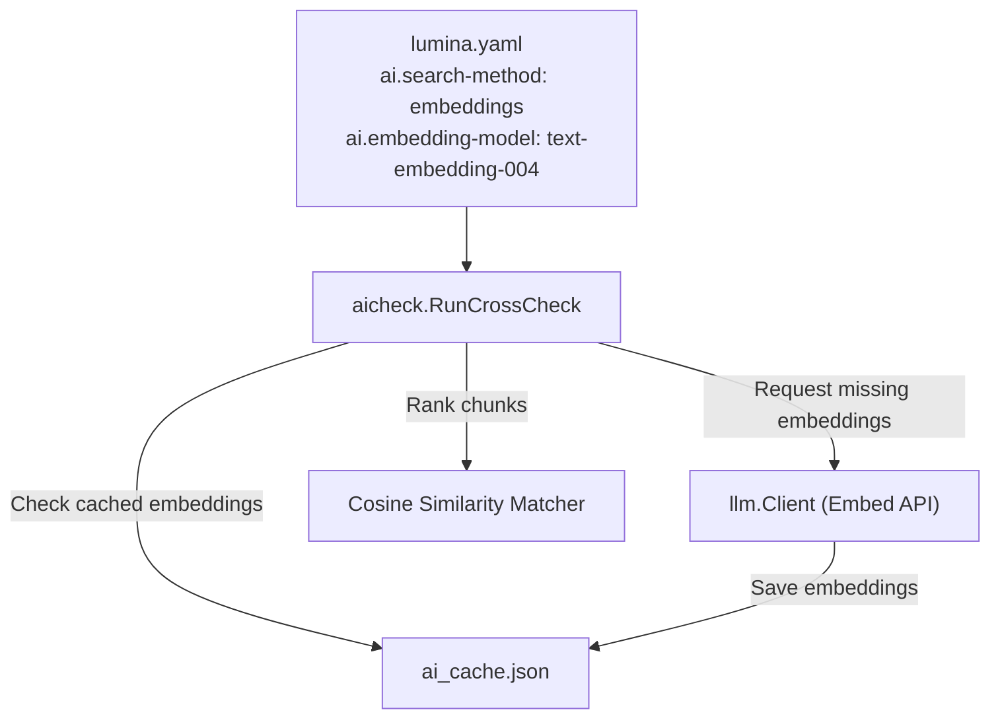

# SDD Spec: Selectable Search Method (BM25 or Embeddings) and Paragraph Extraction Debug Helper

## Metadata

* **Status:** `COMPLETED`
* **Author:** Antigravity (agent)
* **Created:** 2026-07-09
* **Last Updated:** 2026-07-09
* **Approver:** Konstantin Sharlaimov

---

## Phase 1: Proposal (Rough Idea)

### 1.1 Problem Statement

Currently, Lumina's AI literature cross-checking pipeline (`lumina ai check`) relies solely on the BM25 lexical ranking engine to find candidate passages from literature PDFs. Lexical search might miss semantically similar but lexically different matches. Furthermore, there is no way for the author to configure the relevance threshold for matching or select alternative semantic embedding models. 

Additionally, debuggability is limited. When citation check issues arise, it is difficult to see exactly how paragraphs and their inline citations are extracted from the manuscript.

### 1.2 Proposed Solution

1. **Selectable Search Methods**: Extend the literature cross-checking coordinator to support either `bm25` (lexical) or `embeddings` (semantic) search for matching manuscript claims with literature chunks.
2. **Configurable Thresholds**: Support a score/similarity threshold in `lumina.yaml` to filter out irrelevant passage results.
3. **Selectable Embedding Model**: Support choosing custom embedding models (e.g. `text-embedding-004` or `text-embedding-3-small`) via the configuration.
4. **On-Demand Embedding Generation and Caching**: Embeddings are generated dynamically when required. The existing `ai_cache.json` mechanism will be used to cache computed embedding vectors, avoiding the need for a separate vector database or offline pre-calculation.
5. **Debug Commands**: Add a `lumina debug` command group with a `paragraphs` subcommand (aliases: `extract-paragraphs`, `extract`) to print all extracted prose paragraphs and their resolved inline citation keys.

### 1.3 Scope & Requirements

* **In Scope:**
  * Add configuration options to `lumina.yaml` under the `ai` section: `search-method` (`bm25` | `embeddings`), `search-threshold` (float), and `embedding-model` (string).
  * Implement an embedding generation interface for Gemini and OpenAI client providers.
  * Integrate semantic embedding-based similarity search (cosine similarity) as an option in the document matching step of the cross-check coordinator.
  * Cache computed text embedding vectors in `ai_cache.json` using the text hash and embedding model name.
  * Add the `lumina debug` command group and `lumina debug paragraphs` subcommand to extract and print manuscript paragraphs/citations.
* **Out of Scope:**
  * Setting up or maintaining a local vector database (like Milvus or Qdrant).
  * Pre-calculating and indexing whole literature libraries ahead of runtime (embeddings are fetched and matched dynamically).

---

## Phase 2: System Design (SDD)

### 2.1 Architecture & Components

The matching engine will branch depending on the selected `search-method` in `lumina.yaml`. If `embeddings` is chosen, the coordinator uses the LLM Client to obtain embeddings for the query (manuscript paragraph/assertion) and candidate chunks, and then computes cosine similarity.



### 2.2 Data Structures & Interfaces

#### Configuration Schema (`internal/config/config.go`)
We extend `AIConfig` with three new fields:
```go
type AIConfig struct {
	Provider         string  `yaml:"provider"`
	Model            string  `yaml:"model"`
	BaseURL          string  `yaml:"base-url"`
	Temperature      float64 `yaml:"temperature"`
	SearchMethod     string  `yaml:"search-method"`     // "bm25" (default) or "embeddings"
	SearchThreshold  float64 `yaml:"search-threshold"`  // threshold (e.g. 0.0 to 1.0)
	EmbeddingModel   string  `yaml:"embedding-model"`   // e.g. "text-embedding-004"
}
```

#### LLM Client Embed API (`internal/aicheck/llm/llm.go`)
We extend `Client` to support embedding generation:
```go
type Client interface {
	ModelName() string
	Call(ctx context.Context, prompt string) (string, error)
	Embed(ctx context.Context, text string, model string) ([]float32, error)
}
```

### 2.3 Protocol / API Changes

#### Gemini Embed Endpoint
Uses the Gemini Embed Content API:
`POST https://generativelanguage.googleapis.com/v1beta/models/{model}:embedContent?key={API_KEY}`
Request:
```json
{
  "content": {
    "parts": [{ "text": "text to embed" }]
  }
}
```
Response:
```json
{
  "embedding": {
    "values": [0.0123, -0.0456, ...]
  }
}
```

#### OpenAI Embed Endpoint
Uses the standard OpenAI Embeddings API:
`POST {BaseURL}/embeddings`
Request:
```json
{
  "input": "text to embed",
  "model": "text-embedding-3-small"
}
```
Response:
```json
{
  "data": [
    {
      "embedding": [0.0123, -0.0456, ...],
      "index": 0
    }
  ]
}
```

### 2.4 Real-Time & Resource Impacts

* **Token & Latency Cost**: If using embeddings, each unique literature chunk and manuscript paragraph must be embedded once. Caching calculated embeddings in `ai_cache.json` limits API requests to newly introduced text segments only.
* **Accuracy Threshold**: Cosine similarity values typically range between 0 and 1. A default threshold of `0.0` will return all matches, while setting `0.6` or higher limits candidates to highly relevant chunks.

---

## Phase 3: Implementation Plan (IP)

### 3.1 Task Breakdown

- [x] **Task 1: Add new config keys to `internal/config`**
  - **Files:** `internal/config/config.go`, `internal/config/config_test.go`
  - **Verification:** `go test ./internal/config/...`
- [x] **Task 2: Extend LLM Client interface and implementations with `Embed`**
  - **Files:** `internal/aicheck/llm/llm.go`, `internal/aicheck/llm/gemini.go`, `internal/aicheck/llm/openai.go`, `internal/aicheck/llm/cached.go`
  - **Verification:** `go build ./internal/aicheck/llm/...`
- [x] **Task 3: Implement semantic matching and cosine similarity in `internal/aicheck`**
  - **Files:** `internal/aicheck/embeddings.go` (new file or helper functions), `internal/aicheck/aicheck.go`
  - **Verification:** `go test ./internal/aicheck/...`
- [x] **Task 4: Add debug command group and paragraphs subcommand**
  - **Files:** `cmd/root.go`, `cmd/debug/debug.go`, `cmd/debug/paragraphs.go`
  - **Verification:** `make build` and run `./_build/lumina debug paragraphs` on `testdata/sample`

### 3.2 Risks & Mitigation

* **Risk:** The configured embedding model is invalid or unsupported.
  * **Mitigation:** Fall back to default embedding models: `text-embedding-004` for Gemini, and `text-embedding-3-small` for OpenAI. Return a clear error if the API call fails due to invalid model naming.

---

## Phase 4: Execution & Verification

- [x] All per-task verification steps pass.
- [x] Linter / vet clean.
- [x] Unit tests pass.
- [x] Build targets compile.
- [x] Neighbor packages unaffected.
- [x] Approved by the User.

---

## Phase 5: Completed

- [x] All Phase 4 items `[x]`.
- [x] No regressions.
- [x] Spec document reflects actual implementation.
- [x] `spec/README.md` updated to `COMPLETED`.
- [x] Approved by the User.
