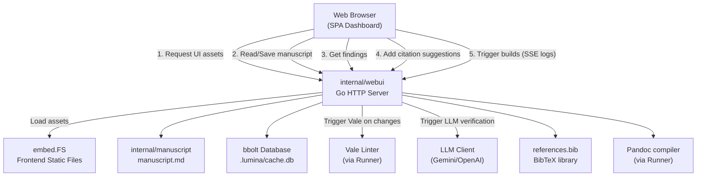

# SDD Spec: Web UI Dashboard

## Metadata

* **Status:** `DESIGN`
* **Author:** Antigravity (agent)
* **Created:** 2026-07-09
* **Last Updated:** 2026-07-09
* **Approver:** Konstantin Sharlaimov

---

## Phase 1: Proposal (Rough Idea)

### 1.1 Problem Statement

While Lumina provides powerful command-line tools for linting, citation checking, and building manuscripts, terminal-based outputs can be dense and difficult to navigate for large manuscripts with dozens of citation alerts, lint warnings, and uncited assertions. Additionally, operations like reviewing and accepting citation suggestions require manual file edits (copying/pasting BibTeX entries into `references.bib` and manually typing citation keys into `manuscript.md`).

The cost of doing nothing: authors miss critical quality alerts in long terminal scrolls, and the workflow of resolving citation suggestions remains slow and error-prone.

### 1.2 Proposed Solution

Introduce a new command group/subcommand `lumina ui` (or `lumina web`) that launches a local web server (embedded in the Go binary) and opens a web browser dashboard. 

The dashboard will provide:
1. **Inline Markdown Editor with Highlights**: A web-based Markdown editor (e.g., CodeMirror or Monaco) loaded with `manuscript.md` that highlights writing issues (prose violations, citation warnings, uncited claims) directly in the text with squiggles, inline decorations, or gutter icons.
2. **Interactive Quality Dashboard**: A visual overview of the manuscript health, including word counts (plotted against limits), Vale prose linting warnings, and TODO scans.
3. **AI Cross-Check Panel**: An interactive view of `ai_check_report.md` results, allowing users to see claims, supporting passages, and suggested citations.
4. **One-Click Bibliography Integration**: A way to review suggested literature for uncited claims and import selected candidate papers into `references.bib` with a single click.
5. **Visual Build Trigger & Log Viewer**: Trigger document builds (PDF, DOCX, TeX, ZIP) directly from the UI and view live compiler output.

### 1.3 Scope & Requirements

* **In Scope:**
  * **New CLI Subcommand**: `lumina ui` (starts local HTTP server, default port `8080`, automatically opens user's browser).
  * **Embedded Web Application**: Built as a Single Page Application (HTML/CSS/JS) embedded into the Go binary using `embed.FS`.
  * **Web-based Markdown Editor**: In-place editing of `manuscript.md` using a rich text editor.
  * **Inline Finding Overlays**: Highlights for Vale errors, missing citations, and uncited assertions directly in the editor (via squiggles/gutter markers). Tooltips show detailed feedback when hovering over highlighted segments.
  * **Manuscript Health Visualizer**: Display gauges/charts for word counts, error/warning tallies for Vale, and citation statuses.
  * **Interactive Citation Assistant**: Interactive cards for uncited claims with details from local BM25 ranking. Clicking "Accept Suggestion" automatically adds the selected BibTeX entry to `references.bib` and copies the citation key to the clipboard (or inserts it).
  * **Local API Endpoints**: Go backend endpoints for reading manuscript state, saving the manuscript, listing citation warnings, running builds, and mutating `references.bib`.
  * **Console Logger Streaming**: Stream compilation logs in real-time to the dashboard via WebSockets or Server-Sent Events (SSE).

* **Out of Scope:**
  * **Cloud Hosted SaaS**: The Web UI runs strictly locally on the user's host machine. No authentication or user accounts are implemented.
  * **Multi-file Project Editor**: The editor is optimized specifically for editing the primary `manuscript.md` source, not for full IDE-style workspace editing.
  * **Git / VCS Control**: Managing git commits, branches, or pushes is left to the git CLI or editor integrations.

### 1.4 Editor & Finding Tracking Design

#### Editor Choice: Markdown Source + HTML Live Preview (Not WYSIWYG)
WYSIWYG editors risk breaking custom Markdown formatting, pandoc acronym syntax (`+KEY`), citations (`[@key]`), and Mermaid code blocks. To keep the manuscript clean:
1. **Editor**: A source-level editor (e.g., CodeMirror or Monaco) with Markdown syntax highlighting.
2. **Preview**: A side-by-side live-rendering HTML preview. Pandoc compiles Markdown to HTML with MathJax (for equations) and a clean stylesheet. This renders in tens of milliseconds, avoiding the heavy overhead of PDF compilation.
3. **Heavy Builds**: Production formats like PDF/DOCX are built only on explicit request via action buttons, not on live reload.

#### Tracking Findings & Unified Cache Scheme
To prevent offset drift and avoid redundant tool execution (Vale, LLM) when the source changes, we implement a **Unified Findings Cache**:
1. **Cache Keying**: Keyed by the SHA-256 hash of the paragraph's raw text content: `hash(paragraph_text)`.
2. **Cache Contents**: For each paragraph, the cache (saved under `.lumina/findings_cache.json`) stores:
   - Linter (Vale) alerts (with offsets relative to the paragraph start).
   - Citation warnings (missing keys, duplicate titles).
   - AI check verdicts (status, reasoning, supporting passages).
3. **Paragraph-Level Alignment**:
   - The editor splits the document into paragraphs (via AST parsing).
   - It maps active editor decorations to paragraph hashes.
   - When the user edits paragraph A, only paragraph A's cache is invalidated. Paragraphs B, C, and D remain cached.
4. **Incremental Checking**:
   - On document save/change, only uncached (newly edited) paragraphs are passed to Vale or the AI cross-checker.
   - Unmodified paragraphs load their alerts immediately from the findings cache.

---

## Phase 2: System Design (SDD)

### 2.1 Architecture & Components

The Web UI backend is implemented inside the CLI Go binary by adding a new package `internal/webui` containing the HTTP server and API routing logic. The frontend assets (HTML, CSS, JS) are packaged using Go's `embed` package and served directly from memory.

To prevent disk clutter and provide transaction safety, all caching (literature text, AI cross-check verdicts, and linter findings) is unified under a single **BoltDB** database file located at `.lumina/cache.db`.



### 2.2 Data Structures & Interfaces

#### Unified Cache Schema (BoltDB)
The database `.lumina/cache.db` will use three distinct BoltDB buckets:

1. **`literature` Bucket**
   * **Key**: `pdf_hash` (string)
   * **Value**: JSON representation of `cache.LitCacheEntry` (contains extracted chunks, BibTeX entry, full text).
2. **`llm` Bucket**
   * **Key**: `hash(prompt + model)` (string)
   * **Value**: Raw LLM string response (JSON string) cached directly by the LLM client.
3. **`findings` Bucket**
   * **Key**: `paragraph_hash` (string)
   * **Value**: JSON representation of `cache.ParagraphFindings` (contains Vale alerts, AI verdicts, and citation warnings for the paragraph).

#### Go Cache Structs
```go
package cache

type ParagraphFindings struct {
	Text      string          `json:"text"`
	Vale      []ValeAlert     `json:"vale"`
	AI        []AIVerdict     `json:"ai"`
	Citation  []CitationWarn  `json:"citation"`
}

type ValeAlert struct {
	Line     int    `json:"line"` // Relative to paragraph start
	Span     [2]int `json:"span"` // [start_char, end_char] relative to paragraph start
	Message  string `json:"message"`
	Severity string `json:"severity"` // "error" | "warning" | "suggestion"
}

type AIVerdict struct {
	CitationKey string   `json:"citation_key"`
	Status      string   `json:"status"` // "supported" | "contradicted" | "unsupported" | "neutral" | "unknown"
	Reasoning   string   `json:"reasoning"`
	Passages    []string `json:"passages"`
}

type CitationWarn struct {
	Kind    string `json:"kind"` // "missing-key" | "duplicate" | "missing-fields"
	Message string `json:"message"`
}
```

### 2.3 Protocol / API Changes

#### CLI Commands
```sh
lumina ui [--port PORT] [--host HOST]
```
* `--port` / `-p`: TCP port to listen on (default: `8080`).
* `--host` / `-h`: Network host address to bind to (default: `127.0.0.1`).

#### HTTP REST Routes
All responses are JSON unless noted otherwise.

1. **`GET /` / `GET /assets/*`**
   * Serves the embedded HTML, CSS, and JS files.
2. **`GET /api/manuscript`**
   * Returns the raw manuscript markdown content and its parsed structural outline.
   * Response:
     ```json
     {
       "content": "# Title...",
       "paragraphs": [
         {
           "hash": "abc123xyz...",
           "text": "Paragraph content text..."
         }
       ]
     }
     ```
3. **`POST /api/manuscript`**
   * Updates `manuscript.md` content and invalidates modified paragraph cache items. Triggers debounced background validation.
   * Body: `{ "content": "Updated manuscript markdown..." }`
   * Response: `{ "success": true }`
4. **`GET /api/findings`**
   * Retrieves all findings from `.lumina/findings_cache.json`.
5. **`POST /api/bib/add`**
   * Appends a new BibTeX entry to `references.bib`.
   * Body: `{ "entry": "@article{...}" }`
   * Response: `{ "success": true }`
6. **`GET /api/preview`**
   * Serves the dynamically compiled preview HTML document directly (Content-Type: `text/html`).
7. **`GET /api/build/stream?format=pdf|docx|zip`**
   * Server-Sent Events (SSE) route. Triggers the requested format compilation and streams build stdout/stderr lines as events.
   * Events:
     * `event: log`, `data: Compile output...`
     * `event: success`, `data: build completed`
     * `event: error`, `data: build failed`

### 2.4 Real-Time & Resource Impacts

* **Build Latency**: Pre-compiling to HTML via Pandoc with MathJax renders in <100ms. PDF rendering is deferred to manual triggers, saving system CPU and reducing latency during writing.
* **Server Footprint**: The Go HTTP server uses standard library handlers. Peak RAM usage will remain under `50MB` for local operations.
* **Incremental Check Overhead**: Saving changes splits the document into paragraphs. Only paragraphs whose content hashes have changed are passed to Vale or the LLM cross-checker, keeping LLM token consumption and check latency to a minimum.

---

---

## Phase 3: Implementation Plan (IP)

*To be completed in Phase 3.*

---

## Phase 4: Execution & Verification

*To be completed in Phase 4.*

---

## Phase 5: Completed

*To be completed in Phase 5.*
