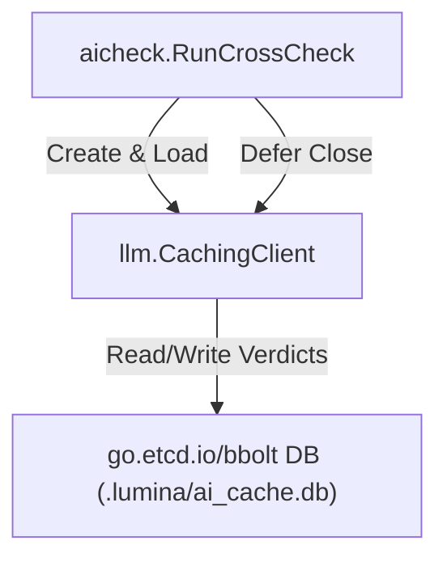

# SDD Spec: AI Query Cache Migration to BoltDB

## Metadata

* **Status:** `COMPLETED`
* **Author:** Antigravity (agent)
* **Created:** 2026-07-09
* **Last Updated:** 2026-07-09
* **Approver:** Konstantin Sharlaimov

---

## Phase 1: Proposal (Rough Idea)

### 1.1 Problem Statement

Lumina's LLM query cache currently relies on a single JSON file (`ai_cache.json`) under `.lumina/ai_cache.json`.
This approach has several limitations:
1. **Performance**: For each new cache entry, the entire JSON file must be read, unmarshaled, appended to, marshaled, and rewritten to disk. As the cache grows, this overhead increases.
2. **Concurrency**: While protected by a mutex in memory, disk operations on a single file are prone to write contention and lack fine-grained transactions.
3. **Robustness**: If a build process is aborted mid-write, the JSON file can be corrupted.

### 1.2 Proposed Solution

Migrate the AI query cache from `ai_cache.json` to an embedded key/value database using BoltDB (`go.etcd.io/bbolt`).
1. Store the database in `.lumina/ai_cache.db`.
2. Use a bucket named `"ai_cache"`.
3. Keys will be the SHA-256 hashes of the prompts (`ComputeLLMKey`).
4. Values will be the JSON-serialized `LLMCacheEntry` structs.
5. Provide a `Close()` method on `CachingClient` to release the database file lock at the end of execution.

### 1.3 Scope & Requirements

* **In Scope:**
  * Add `go.etcd.io/bbolt` as a project dependency.
  * Implement BoltDB load, save, get, and close methods in `internal/aicheck/cache/cache.go` or a dedicated DB client.
  * Refactor `CachingClient` in `internal/aicheck/llm/cached.go` to query and write to the BoltDB database using transactions.
  * Ensure the database file lock is safely closed when `RunCrossCheck` finishes.
  * Support clearing the BoltDB cache file when `--force` or `lumina clean` is invoked.
  * **Validate LLM Responses**: Do not populate the cache if an LLM response fails to deserialize (e.g. is not syntactically valid JSON after stripping markdown blocks).
* **Out of Scope:**
  * Migrating the literature PDF cache files (these will remain as individual `.yaml` files under `.lumina/literature_cache/`).

---

## Phase 2: System Design (SDD)

### 2.1 Architecture & Components



### 2.2 Data Structures & Interfaces

We will add a new dependency: `go.etcd.io/bbolt`.

In `internal/aicheck/cache/cache.go`:
- Remove `LoadLLMCache`, `SaveLLMCache`, `LLMCache` map-based cache logic.
- BoltDB database helper methods will manage the key/value operations:
```go
type AICacheDB struct {
	db *bbolt.DB
}

func OpenAICache(root string) (*AICacheDB, error)
func (c *AICacheDB) Close() error
func (c *AICacheDB) Get(key string) (string, error)
func (c *AICacheDB) Put(key string, val string) error
```

In `internal/aicheck/llm/cached.go`:
- Update `CachingClient` to hold `*cache.AICacheDB` instead of `cache.LLMCache`.
- Add `Close()` method to `CachingClient` to close the database.

---

## Phase 3: Implementation Plan (IP)

### 3.1 Task Breakdown

- [x] **Task 1: Add `go.etcd.io/bbolt` dependency to `go.mod`**
  - **Files:** `go.mod`
  - **Verification:** `go get go.etcd.io/bbolt`
- [x] **Task 2: Refactor `internal/aicheck/cache` to use BoltDB**
  - **Files:** `internal/aicheck/cache/cache.go`
  - **Verification:** `go test ./internal/aicheck/cache/...`
- [x] **Task 3: Refactor `CachingClient` to use the BoltDB cache**
  - **Files:** `internal/aicheck/llm/cached.go`, `internal/aicheck/llm/llm_test.go`
  - **Verification:** `go test ./internal/aicheck/llm/...`
- [x] **Task 4: Add Close defer calls in coordinator and commands**
  - **Files:** `internal/aicheck/aicheck.go`, `cmd/ai/check.go`
  - **Verification:** `make build` and verify `lumina ai check` on `testdata/sample`

### 3.2 Risks & Mitigation

* **Risk:** Concurrent processes trying to access the same BoltDB file will hang on `bbolt.Open` lock acquisition.
  * **Mitigation:** Set a short timeout (e.g. 2 seconds) on opening the database to fail fast and notify the user if another Lumina process is already running.

---

## Phase 4: Execution & Verification

- [x] All per-task verification steps pass.
- [x] Linter / vet clean.
- [x] Unit tests pass.
- [x] Build targets compile.
- [x] Neighbor packages unaffected.
- [x] Approved by the User.

---

## Phase 5: Completed

- [x] All Phase 4 items `[x]`.
- [x] No regressions.
- [x] Spec document reflects actual implementation.
- [x] `spec/README.md` updated to `COMPLETED`.
- [x] Approved by the User.
