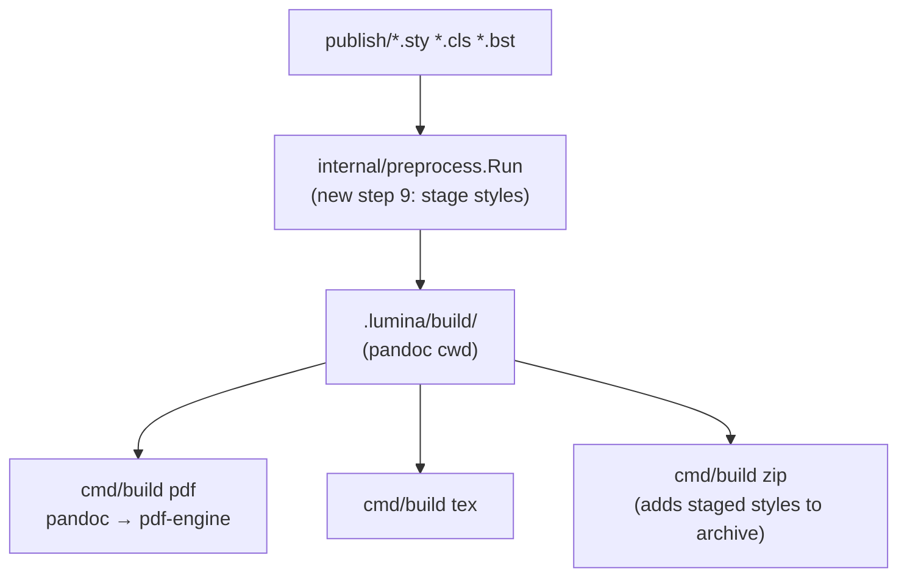

# SDD Spec: LaTeX Style (.sty) File Support

## Metadata
* **Status:** `COMPLETED`
* **Author:** Claude (agent), for Konstantin Sharlaimov
* **Created:** 2026-07-15
* **Last Updated:** 2026-07-15
* **Approver:** Konstantin Sharlaimov

---

## Phase 1: Proposal (Rough Idea)

### 1.1 Problem Statement

Journals and conferences ship submission kits containing LaTeX style
packages (`.sty`, sometimes `.cls`, `.bst`) that the manuscript's template
loads via `\usepackage{...}` / `\documentclass{...}`. Lumina already picks
up a custom pandoc template at `publish/template.tex`, but any style files
that template depends on are invisible to the build: the PDF engine runs
from `.lumina/build/` (host or Docker), the style files are never staged
there, and TeX cannot resolve them. The build fails with
`! LaTeX Error: File 'xyz.sty' not found.`

The `zip` submission archive has the same gap: it packages only
`manuscript.tex`, `references.bib`, and `figures/`, so a journal receiving
the archive cannot compile it when custom styles are required.

Cost of doing nothing: any venue with a custom style kit (most engineering
journals, IEEE/ACM conferences) cannot be targeted with lumina end-to-end;
users must hand-patch the build directory after every preprocess run.

### 1.2 Proposed Solution

Treat `publish/` as the home for LaTeX support files, consistent with the
existing `publish/template.tex` convention:

1. **Staging:** during preprocess (or build), copy LaTeX support files
   from `publish/` (`*.sty`, `*.cls`, `*.bst`) into the build working
   directory so the PDF engine resolves them naturally — pandoc's PDF
   engine inherits the working directory on its TEXINPUTS path. Works
   identically under host and Docker runners since both execute in the
   staged directory.
2. **Submission archive:** `lumina build zip` includes the same support
   files in the ZIP so the archive compiles standalone at the journal.
3. **Cache/staleness:** staged copies refresh when the source files
   change, and honor `--force`.

No new config keys: presence of the files in `publish/` is the opt-in,
mirroring how `publish/template.tex` already works.

### 1.3 Scope & Requirements

* **In Scope:**
  * Stage `publish/*.sty`, `publish/*.cls`, `publish/*.bst` into the build
    dir for `build pdf` and `build tex` runs.
  * Include those files in the `build zip` archive.
  * Staleness detection so edits to style files trigger restaging.
  * README documentation of the `publish/` convention.
* **Out of Scope:**
  * Fetching/vendoring style kits from journal URLs (future spec if ever
    needed).
  * Supporting arbitrary extra TeX inputs outside `publish/` or a
    configurable TEXINPUTS path list.
  * Validating that the template actually uses the staged packages.
  * DOCX builds (`.sty` is meaningless there).

---

## Phase 2: System Design (SDD)

### 2.1 Architecture & Components

All changes ride on existing abstractions; no new packages.



**Why staging into `.lumina/build/` is sufficient for PDF:** pandoc runs
the PDF engine in a temporary directory but prepends its own working
directory to `TEXINPUTS` for the engine invocation. Lumina always runs
pandoc with cwd `ms.LuminaBuildDir()` (see `pandoc.Invocation.Run`), so
any `.sty`/`.cls`/`.bst` staged there is resolvable by
`\usepackage`/`\documentclass`. This holds for both runners:
`HostRunner` runs pandoc in that directory directly; `DockerRunner` runs
it at the same path mounted under `/workspace`. No engine flags, no env
plumbing, no runner changes.

**Components touched:**

1. `internal/preprocess` — new staging step + staleness inputs:
   * `stageStyleFiles(ms)` — copy `publish/{*.sty,*.cls,*.bst}` (flat, no
     recursion) into `.lumina/build/`, and **delete** staged
     `*.sty/*.cls/*.bst` in `.lumina/build/` that no longer exist in
     `publish/` (sync semantics, prevents ghost styles after user removes
     one). Only files matching the three extensions are ever deleted —
     other build-dir content untouched.
   * `IsStale` — also compare mtimes of `publish/` style files against
     `.lumina/manuscript.md`, plus report stale when the staged set
     differs from the source set (covers file deletion, which mtime
     checks miss).
2. `cmd/build/zip.go` — after TeX staging, enumerate style files present
   in `publish/` and append their basenames to the `zip` args (they are
   already staged in `.lumina/build/`, the zip cwd).
3. `README.md` — document convention next to existing
   `publish/template.tex` docs.

`cmd/build/pdf.go` and `cmd/build/tex.go` need **no changes**: both
already call `preprocess.Run` first.

### 2.2 Data Structures & Interfaces

No new types, no config keys. One new package-level helper:

```go
// styleExtensions lists LaTeX support-file extensions staged from publish/.
var styleExtensions = []string{".sty", ".cls", ".bst"}

// listStyleFiles returns basenames of LaTeX support files directly under
// publish/ (no recursion), sorted, or nil if the directory is absent.
func listStyleFiles(root string) ([]string, error)
```

Shared by preprocess (staging + staleness) and zip (archive listing).
Lives in `internal/preprocess`, exported as `ListStyleFiles` since
`cmd/build/zip.go` needs it.

Invariants:
* `publish/` absent or empty of matching files → no-op, zero behavior
  change for existing manuscripts.
* Only basenames staged — subdirectories of `publish/` ignored (kits are
  flat; recursion is out of scope).
* Copy errors are hard errors (unlike optional `references.bib`): if the
  file exists, user intends it to be used.

### 2.3 Protocol / API Changes

* No CLI flag changes. `--force` already forces `preprocess.Run`, which
  now also restages styles.
* ZIP archive contents gain `<name>.sty|cls|bst` entries at archive root
  (flat, alongside `manuscript.tex`) — matches journal submission
  expectations.
* README: new "LaTeX style files" rows/paragraph in directory-layout and
  publish docs.

### 2.4 Real-Time & Resource Impacts

Cold path only (build-time CLI). Cost: one `os.ReadDir` of `publish/` +
`O(n)` file copies of small text files per preprocess run. No latency or
allocation budget concerns. Verified by existing test suite runtime.

### 2.5 Trade-offs Considered

* **TEXINPUTS env var instead of copying** — rejected: `Runner` interface
  has no env plumbing, Docker runner would need `-e` support, and pandoc
  child-process env propagation is fragile. Copying is dumb and correct.
* **Configurable style dir in `lumina.yaml`** — rejected for now:
  `publish/` convention already exists for `template.tex`; zero-config
  wins. Revisit if a real kit demands nested dirs.
* **Staging `.bst` questionable?** — kept: `natbib`-style kits ship
  `.bst`, harmless when unused (citeproc path ignores it), needed in ZIP
  for journals compiling with bibtex.

---

## Phase 3: Implementation Plan (IP)

### 3.1 Task Breakdown

- [x] **Task 1: Style-file enumeration and staging in `internal/preprocess`**
  - **Files:** `internal/preprocess/styles.go` (new),
    `internal/preprocess/styles_test.go` (new)
  - Add `styleExtensions`, `ListStyleFiles(root)` (sorted basenames of
    `publish/{*.sty,*.cls,*.bst}`, nil when dir absent), and
    `stageStyleFiles(ms)` implementing copy + orphan deletion (sync)
    into `.lumina/build/`.
  - Tests: absent `publish/`, empty dir, mixed extensions filtered,
    staging copies content, orphan `.sty` removed, non-style build-dir
    files untouched.
  - **Verification:** `go test ./internal/preprocess/... -v`

- [x] **Task 2: Wire staging into `preprocess.Run` and `IsStale`**
  - **Files:** `internal/preprocess/preprocess.go`,
    `internal/preprocess/preprocess_test.go`
  - Call `stageStyleFiles` as step 9 of `Run`. Extend `IsStale`: style
    file newer than intermediate → stale; staged set ≠ source set →
    stale.
  - Tests: touch `.sty` → stale; delete `.sty` → stale; unchanged → not
    stale.
  - **Verification:** `go test ./internal/preprocess/... -v`

- [x] **Task 3: Include style files in ZIP archive**
  - **Files:** `cmd/build/zip.go`
  - After TeX staging, call `preprocess.ListStyleFiles(ms.Root)` and
    append basenames to `zipArgs`.
  - **Verification:** `go build ./... && go vet ./cmd/...`

- [x] **Task 4: Documentation**
  - **Files:** `README.md`
  - Document `publish/*.sty|*.cls|*.bst` convention in directory-layout
    table and custom-template section; note ZIP inclusion.
  - **Verification:** manual read-through; `make test` still green.

- [x] **Task 5: Full verification + end-to-end smoke**
  - **Files:** none (verification only)
  - `make build && make vet && make test`. Smoke: scaffold temp
    manuscript in `/tmp`, drop trivial `publish/test.sty` +
    `template.tex` with `\usepackage{test}`, run `lumina build pdf` and
    `lumina build zip`, confirm PDF builds and `unzip -l` lists
    `test.sty`. (Skip PDF smoke if no TeX toolchain on host — then
    verify staged file presence in `.lumina/build/` instead.)
  - **Verification:** commands above

### 3.2 Risks & Mitigation

* **Pandoc TEXINPUTS assumption wrong for some engine** — mitigated by
  Task 5 smoke test with real `\usepackage`. Fallback if it fails:
  pass `--resource-path`/env via runner (would reopen design).
* **Orphan deletion removes user file** — deletion restricted to the
  three style extensions inside `.lumina/build/` only; `.lumina/` is
  lumina-owned cache, regenerable by design.
* **Docker runner path quirks** — staging is pure host-side `os` I/O
  into mounted workspace; zip lists basenames relative to cwd, same as
  existing entries. No path rewriting involved.

---

## Phase 4: Execution & Verification
- [x] All per-task verification steps pass.
- [x] Linter / vet clean (`go vet ./...`).
- [x] Unit tests pass (`make test`, all packages ok).
- [x] Build targets compile (`make build`).
- [x] Neighbor packages unaffected (full suite green).
- [x] Approved by the User.

### Execution Log (2026-07-15)

* Task 1: added `internal/preprocess/styles.go`
  (`styleExtensions`, `ListStyleFiles`, `stageStyleFiles` with sync
  semantics) + `styles_test.go` (6 tests). All pass.
* Task 2: `preprocess.Run` step 9 stages styles; `IsStale` checks style
  mtimes and staged/source set mismatch. Covered by
  `TestIsStaleTracksStyleFiles`.
* Task 3: `cmd/build/zip.go` appends `ListStyleFiles` basenames to zip
  args; also added an `IsStale`-guarded `preprocess.Run` to the zip flow
  so newly added style files are staged even when the TeX source itself
  is fresh (gap found during implementation).
* Task 4: README directory-layout table + `build zip` row updated.
* Task 5: smoke verified on host:
  * Raw pandoc + pdflatex from a cwd containing `test.sty` with
    `\usepackage{test}` produced a PDF rendering the package's macro —
    confirms pandoc puts its cwd on TEXINPUTS for the PDF engine (the
    design's key assumption).
  * Real `lumina build pdf` in a scaffolded temp manuscript staged
    `publish/journal.sty`/`journal.cls` into `.lumina/build/`, and
    removing a source style file removed the staged copy on next build
    without `--force`. Full engine run not possible on host
    (`pandoc-acro`/`pandoc-crossref` not installed) — per-plan fallback
    used.

---

## Phase 5: Completed
- [x] All Phase 4 items `[x]`.
- [x] No regressions.
- [x] Spec document reflects actual implementation.
- [x] `spec/README.md` updated to `COMPLETED`.
- [x] Approved by the User (2026-07-15).
