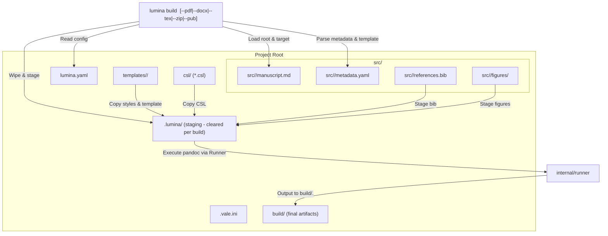

# SDD Spec: Multi-Target Projects

## Metadata

* **Status:** `COMPLETED`
* **Author:** Antigravity (agent)
* **Created:** 2026-09-22
* **Last Updated:** 2026-09-22
* **Approver:** Konstantin Sharlaimov

---

## Phase 1: Proposal (Rough Idea)

### 1.1 Problem Statement

Previously, Lumina treated each manuscript directory as an isolated self-contained repository with its own `lumina.yaml`, `publish/` template directory, and build outputs in `_build/`. In academic writing and research labs, authors often manage multiple related manuscripts (e.g. conference paper, journal extension, supplementary material, workshop paper) within a single project repository.

Requiring duplicate configurations, templates, and CSL style sheets across multiple directories leads to maintenance overhead, inconsistency, and tool divergence.

### 1.2 Proposed Solution

Transform Lumina into a project-level tool:
1. **Multi-Target `src/` Layout**: A project lives in a root directory containing a `src/` directory where each target manuscript has its own subfolder: `src/<target-name>/`.
2. **Project-Root Execution & CLI Arguments**: Lumina commands are executed from the project root and supplied with the target name (e.g. `lumina build <target>`, `lumina init <target>`).
3. **Common Project Configuration & Resources**: `lumina.yaml`, CSL style sheets (`csl/`), and named template kits (`templates/<template-name>/`) reside at the project root and are shared across targets.
4. **Selectable Templates & Custom Output Filename**: Each target's `metadata.yaml` can select a shared template via `template: <name>` and specify custom artifact base names via `output: <name>`.
5. **Unified Output & Cleared Temporary Staging**: Compiled documents are placed in `<root>/build/` named after the target or configured `output`. The intermediate staging directory `<root>/.lumina/` is shared and cleanly wiped between builds.

### 1.3 Scope & Requirements

* **In Scope:**
  * Project-level root detection and validation.
  * Target discovery in `src/<target-name>/`.
  * Support for `lumina build <target>` with format flags: `--pdf`, `--docx`, `--tex`, `--zip`, and publication gate flag `--pub`.
  * Target arguments for `lumina lit {check,prune,fmt} <target>` and `lumina text {words,fmt,lint} <target>`.
  * `lumina init <target>`: Scaffolds both project-level roots (if missing) and target-level folders.
  * `lumina clean`: Clears project `<root>/.lumina/` and `<root>/build/`.
  * Template selection via `template` key in `metadata.yaml` mapped to `templates/<template>/`.
  * Output name override via `output` key in `metadata.yaml`.
  * Common CSL directory `<root>/csl/` resolution.
  * Common temporary directory `<root>/.lumina/` wiped clean between builds.
* **Out of Scope:**
  * Concurrent builds of different targets in the same project workspace at the exact same time (single temporary directory cleared per run).

---

## Phase 2: System Design (SDD)

### 2.1 Architecture & Components



### 2.2 Directory Layout

```
project-root/
├── lumina.yaml             # Common tool configurations
├── .vale.ini               # Common Vale prose linter configuration
├── .gitignore              # Ignores .lumina/, build/, .env
├── csl/                    # Shared CSL bibliography styles
│   └── ...
├── templates/              # Shared named templates
│   └── <template-name>/    # Named template folder (e.g. "default", "ieee")
│       ├── template.tex    # LaTeX template (optional)
│       ├── *.sty, *.cls    # LaTeX style and class files (optional)
│       └── reference.docx  # Word reference styling document (optional)
├── src/                    # Manuscript targets
│   └── <target>/           # Individual manuscript target
│       ├── manuscript.md   # Markdown prose source
│       ├── metadata.yaml   # Target metadata & settings
│       ├── references.bib  # BibTeX citations
│       ├── figures/        # Target-specific static figures
│       └── literature/     # PDFs and reference notes (optional)
├── .lumina/                # Common temporary build directory (cleared before every build)
│   └── build/              # Staged intermediate files
└── build/                  # Common build output directory
    ├── <output>.pdf
    ├── <output>.docx
    ├── <output>.tex
    └── <output>.zip
```

### 2.3 Data Structures & Interfaces

#### Metadata Extension (`src/<target>/metadata.yaml`)
```yaml
title: "Sample Manuscript"
author: "Author Name"
output: "my-custom-output"  # Base output filename (defaults to <target> if omitted)
template: "default"         # Directory name in templates/ (optional)
wordlimit: 6000
csl: "ieee.csl"             # Resolved in src/<target>/ or csl/
bibliography: "references.bib"
```

#### `internal/config`:
```go
type LuminaMetadata struct {
	WordLimit int    `yaml:"wordlimit"`
	Output    string `yaml:"output"`
	Template  string `yaml:"template"`
}
```
`output` and `template` are extracted and stripped from the raw metadata map forwarded to pandoc.

#### `internal/manuscript`:
```go
type Manuscript struct {
	ProjectRoot string
	Target      string
	TargetDir   string
	Source      string
	BibPath     string
	FiguresDir  string
	LuminaDir   string
	BuildDir    string
	Stem        string // resolved from Meta.Output or Target
	TemplateDir string // resolved from templates/<Meta.Template>
	Config      config.Config
	Meta        config.LuminaMetadata
	RawMeta     map[string]any
	Runner      runner.Runner
}

func Load(target string) (*Manuscript, error)
```

### 2.4 CLI Invocations

1. **`lumina build <target> [flags]`**
   * Flags:
     * `--pdf`: Build PDF output.
     * `--docx`: Build DOCX output.
     * `--tex`: Build standalone TeX source.
     * `--zip`: Build ZIP submission archive.
     * `--pub`: Run pre-submission validation gates (citation check, Vale, word limit, TODO check) and create dated artifacts.
     * `--force` / `-f`: Force re-rendering and re-processing.
     * `--pdf-engine ENGINE`: Override PDF engine.
   * If none of `--pdf`, `--docx`, `--tex`, `--zip`, `--pub` are set, all formats configured in `lumina.yaml`'s `formats` list are built.

2. **`lumina lit <subcommand> <target>`**
   * `lumina lit check <target>`
   * `lumina lit prune <target> [--no-dry-run] [--yes/-y]`
   * `lumina lit fmt <target>`

3. **`lumina text <subcommand> <target>`**
   * `lumina text words <target>`
   * `lumina text fmt <target>`
   * `lumina text lint <target>`

4. **`lumina init <target>`**
   * Scaffolds project-level root files if absent (`lumina.yaml`, `.vale.ini`, `.gitignore`, `csl/`, `templates/default/`).
   * Scaffolds target directory `src/<target>/` (`manuscript.md`, `metadata.yaml`, `references.bib`, `figures/`, `literature/`).

5. **`lumina clean`**
   * Removes `<root>/.lumina/` and `<root>/build/`.

---

## Phase 3: Implementation Plan (IP)

### 3.1 Task Breakdown

- [x] **Task 1: Update `internal/config`**
  - Add `Output` and `Template` to `LuminaMetadata`.
  - Extract and strip `output` and `template` in `LoadMetadata`.
  - Update tests in `internal/config/config_test.go`.
  - **Verification:** `go test ./internal/config/...`

- [x] **Task 2: Refactor `internal/manuscript` for Project & Multi-Target**
  - Update `Manuscript` struct with `ProjectRoot`, `TargetDir`, `Stem` (from output or target), and `TemplateDir`.
  - Update `Load(target string)` to discover project root and target path in `src/<target>`.
  - Update `StylesPath()` to find root `.vale.ini`.
  - Update tests in `internal/manuscript/manuscript_test.go`.
  - **Verification:** `go test ./internal/manuscript/...`

- [x] **Task 3: Refactor `internal/preprocess` for Staging & Clean Per-Build**
  - Clear `<root>/.lumina/build` at the start of `preprocess.Run`.
  - Look up CSL files in target dir, then `<root>/csl/`, then `<root>/`.
  - Stage templates and styles from `ms.TemplateDir` (copy `template.tex`, `*.sty`, `*.cls`, `*.bst`).
  - Stage figures from `ms.FiguresDir` and citations from `ms.BibPath`.
  - Update `internal/preprocess/preprocess_test.go` and `internal/preprocess/styles_test.go`.
  - **Verification:** `go test ./internal/preprocess/...`

- [x] **Task 4: Update `internal/citations` and other internals**
  - Ensure `citations.Check` and helper functions work with multi-target `Manuscript`.
  - Update `internal/citations/citations_test.go`.
  - **Verification:** `go test ./internal/citations/...`

- [x] **Task 5: Update `internal/scaffold`**
  - Support project-level scaffolding (`lumina.yaml`, `csl/`, `templates/default/`, `.vale.ini`, `.gitignore`).
  - Support target-level scaffolding (`src/<target>/`).
  - Update `internal/scaffold/scaffold_test.go`.
  - **Verification:** `go test ./internal/scaffold/...`

- [x] **Task 6: Refactor CLI Commands (`cmd/build`, `cmd/lit`, `cmd/text`, `cmd/init.go`, `cmd/clean.go`)**
  - Wire `lumina build <target>` with flags (`--pdf`, `--docx`, `--tex`, `--zip`, `--pub`).
  - Wire target arguments for `lit` and `text` subcommands.
  - Wire `lumina init <target>` and `lumina clean`.
  - Update `cmd/build/zip_test.go`.
  - **Verification:** `go test ./cmd/...`

- [x] **Task 7: Update `testdata/sample` and documentation**
  - Reorganize `testdata/sample` to the new multi-target project layout.
  - Update `README.md` and `AGENTS.md`.
  - **Verification:** `make build`, `make test`, `make vet`.

### 3.2 Risks & Mitigation

* **Risk:** Breaking existing scripts or single-manuscript layouts.
  * **Mitigation:** Clear validation errors when `src/<target>` does not exist or target argument is missing.

---

## Phase 4: Execution & Verification

- [x] All per-task verification steps pass.
- [x] Linter / vet clean.
- [x] Unit tests pass.
- [x] Build targets compile.
- [x] Neighbor packages unaffected.
- [x] Approved by the User.

---

## Phase 5: Completed

- [x] All Phase 4 items `[x]`.
- [x] No regressions.
- [x] Spec document reflects actual implementation.
- [x] `spec/README.md` updated to `COMPLETED`.
- [x] Approved by the User.
