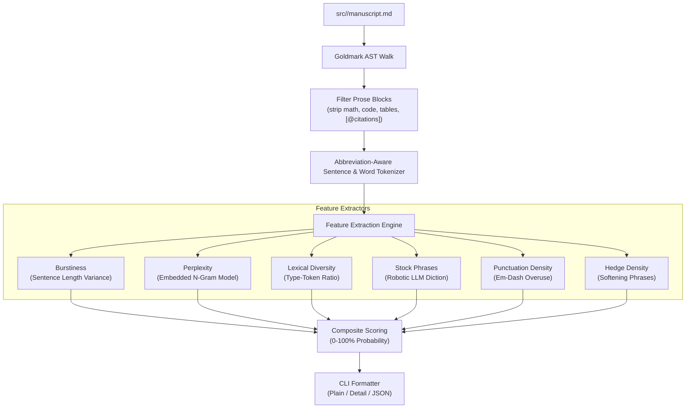

# SDD Spec: AI-Generated Text Detector

## Metadata
* **Status:** `IMPLEMENTED`
* **Author:** Konstantin Sharlaimov
* **Created:** 2026-09-22
* **Last Updated:** 2026-09-22
* **Approver:** Konstantin Sharlaimov

---

## Phase 1: Proposal (Rough Idea)

### 1.1 Problem Statement

Academic journals, conferences, and program committees actively screen submissions for machine-generated prose and reject papers showing heavy LLM footprints. Authors need to know before submission whether sections of their manuscript will trigger AI detection alarms.

Existing commercial AI detection tools (e.g. GPTZero, Originality.ai) pose unacceptable operational trade-offs:
1. **Privacy leak**: They require uploading unpublished, confidential research to third-party web servers.
2. **Cost & lock-in**: They require subscriptions and network connectivity.
3. **Flaky non-reproducibility**: Cloud detectors shift models without notice.

Lumina currently checks citations (`lit check`), prose rules (`text lint`), and length (`text words`), but has no signal for machine-generated prose patterns. Authors need an unvarnished, offline, deterministic check directly in their local workflow.

### 1.2 Proposed Solution

Introduce `lumina text detect <target>` (with alias `lumina text ai <target>`). The command analyzes manuscript prose locally and delivers direct, honest feedback: an AI probability score (0–100%) per paragraph and across the entire manuscript, flagging high-probability machine-generated sections.

Detection relies on deterministic statistical signal without external network calls or heavy neural runtimes:

1. **Perplexity / Predictability (N-Gram LM)**: Unusually flat token predictability indicates machine generation. A compact, pruned n-gram language model, embedded directly into the Go binary, evaluates local token perplexity.
2. **Sentence Burstiness (Variance of Length)**: LLMs produce syntactically uniform sentence lengths. Human academic writing exhibits "burstiness" — high variance between short direct assertions and complex composite statements.
3. **Lexical Diversity & Repetition**: Type-Token Ratio (TTR) and repetitive n-gram frequency across paragraphs.
4. **Robotic Stock-Phrase Density**: Direct pattern-matching against overrepresented LLM markers ("delve", "testament", "pivotal", "in summary", "furthermore", "it is worth noting", "crucial role", etc.).
5. **Punctuation & Hedging Density**: Em-dash overuse and hedge-phrase frequency ("often", "generally", "it is worth noting"), both flagged in independent AI-detection heuristic literature as overrepresented in LLM output relative to human academic prose.

Each paragraph receives an honest composite AI probability score. Sections exceeding the threshold are highlighted in red with exact line numbers and the offending metrics called out plainly.

### 1.3 Scope & Requirements

* **In Scope:**
  * Package `internal/aidetect` providing tokenization, feature extraction, and composite scoring.
  * Structured Markdown extraction using `goldmark` AST to isolate pure prose paragraphs, stripping code blocks, display/inline LaTeX math, table cells, and Pandoc citation keys (`[@cite]`).
  * Abbreviation-aware sentence tokenizer handling academic conventions (`et al.`, `i.e.`, `e.g.`, `Fig.`, `Ref.`, `Eq.`, `Dr.`, `vs.`) to prevent skewed sentence burstiness scores.
  * Compact pruned n-gram language model embedded in binary via `embed.FS`.
  * Offline model-training pipeline: standalone tools under `tools/train-ngram/`
    (not compiled into the `lumina` binary), trained on modern academic prose —
    paper titles and abstracts fetched from the arXiv API, restricted to
    papers submitted on or before 2023-12-31 to avoid corpus contamination by
    widespread LLM-assisted writing (ChatGPT launched November 2022). The
    corpus's source is documented in `tools/train-ngram/README.md`; the
    trained output is committed as `internal/aidetect/assets/model.bin.gz`,
    regenerable on demand but not regenerated at build or run time.
  * New CLI command `lumina text detect <target>` (and alias `lumina text ai <target>`).
  * CLI flags:
    * `--threshold <int>`: Minimum suspicion score to flag (default: 60).
    * `--detail`: Print sub-score breakdown (burstiness, perplexity, stock phrase count).
    * `--json`: Emit machine-readable output for scripts and automated checks.
  * Nested-section support added to `internal/config` (first consumer of a
    non-flat config block), so `lumina.yaml` can carry `text: detect: *`.
  * Unit tests validating each heuristic in isolation against synthetic
    fixtures engineered to trip it (uniform sentence lengths for burstiness,
    high stock-phrase density, low type-token ratio, etc.) — no real-world
    "AI-generated" text is sourced or shipped.

* **Out of Scope:**
  * Network requests, telemetry, or remote API calls.
  * Runtime model training on user manuscripts.
  * Automatic prose rewriting or paraphrasing.
  * Mandatory `--pub` build gate failure by default (remains an advisory audit; optional `--fail-under` flag can be introduced later).
  * Tokenization of non-English text (v1 targets English academic prose).

---

## Phase 2: System Design (SDD)

### 2.1 Architecture & Components



`tools/train-ngram/` sits outside this runtime path entirely: it is run
offline, by hand, to produce the `model.bin.gz` asset that `F2` loads at
`go:embed` time. It never runs as part of `lumina text detect`.

**Components:**
1. **`internal/aidetect/parser.go`**: Walks Goldmark AST. Extracts paragraph text, records source line numbers, cleans citations (`[@...]`) and inline math (`$...$`).
2. **`internal/aidetect/tokenizer.go`**: Splits paragraph into words and sentences. Recognizes common academic abbreviations to ensure accurate boundary detection.
3. **`internal/aidetect/ngram.go`**: Evaluates word sequence probabilities against an embedded pruned n-gram frequency trie loaded from `internal/aidetect/assets/model.bin.gz`.
4. **`internal/aidetect/scorer.go`**: Computes standard deviation of sentence lengths (burstiness), vocabulary richness, stock-phrase frequency, em-dash density, and hedge-phrase density, returning a normalized 0–100 AI probability score.
5. **`cmd/text/detect.go`**: Registers `detect` and `ai` subcommands under `lumina text`. Handles CLI flags, terminal rendering via `internal/logx`, and JSON serialization.
6. **`tools/train-ngram/main.go`** *(build-time only, never imported by `lumina`)*: standalone
   Go program that reads a source corpus, builds a pruned n-gram frequency
   table, and writes the compressed `model.bin.gz` consumed by component 3.
   Run manually by a maintainer when the model needs regenerating — not part
   of `make build`, `make test`, or any CI path that runs on every commit.
   `tools/train-ngram/fetchcorpus/main.go` fetches that source corpus (arXiv
   abstracts) via arXiv's public API. `tools/train-ngram/README.md`
   documents the corpus source and exact invocation used to produce the
   committed model.

### 2.2 Data Structures & Interfaces

```go
package aidetect

// Options configures the detector engine.
type Options struct {
	Threshold     int      // Minimum score to flag as AI-generated (0-100, default: 60)
	ModelPath     string   // Optional external model path; defaults to embedded model
	IgnorePhrases []string // Stock/hedge phrases exempted from scoring (lumina.yaml text.detect.ignore_phrases)
}

// ParagraphReport contains evaluation results for a single paragraph.
type ParagraphReport struct {
	LineNumber    int      `json:"line"`
	TextSnippet   string   `json:"snippet"`
	Score         int      `json:"score"` // 0 - 100
	IsFlagged     bool     `json:"flagged"`
	SentenceCount int      `json:"sentences"`
	Burstiness    float64  `json:"burstiness"`
	Perplexity    float64  `json:"perplexity"`
	StockPhrases  []string `json:"stock_phrases,omitempty"`
	EmDashDensity float64  `json:"em_dash_density"` // em-dashes per 100 words
	HedgeDensity  float64  `json:"hedge_density"`   // hedge phrases per 100 words
}

// ManuscriptReport aggregates results across the document.
type ManuscriptReport struct {
	Target           string            `json:"target"`
	TotalParagraphs  int               `json:"total_paragraphs"`
	FlaggedCount     int               `json:"flagged_paragraphs"`
	OverallAIScore   int               `json:"overall_score"` // 0 - 100
	Paragraphs       []ParagraphReport `json:"paragraphs"`
}

// Detector analyzes manuscript text for AI generation patterns.
type Detector interface {
	Analyze(markdown []byte) (*ManuscriptReport, error)
}
```

### 2.3 Protocol / API Changes

* **New Command**: `lumina text detect <target>`
* **Command Alias**: `lumina text ai <target>`
* **Flags**:
  * `-t, --threshold <int>`: Flagging threshold (default: `60`).
  * `-d, --detail`: Output detailed metric breakdowns per flagged paragraph.
  * `-j, --json`: Machine-readable JSON output.
* **Config (`lumina.yaml`)**:
  ```yaml
  text:
    detect:
      threshold: 60
      ignore_phrases:
        - "in conclusion"
  ```
* **`internal/config` change**: `Config` is a flat struct today (`pdf-engine`,
  `formats`, `runner`, `tools-image`), with defaults hand-filled after
  `yaml.Decode`. This is the first nested block, so `Config` gains a
  `Text TextConfig \`yaml:"text"\`` field, `TextConfig` gains `Detect
  DetectConfig \`yaml:"detect"\``, and default-filling is extended the same
  hand-rolled way (`if cfg.Text.Detect.Threshold == 0 { ... }`) rather than
  introducing a new defaulting mechanism. This is a template other
  command-scoped config (future `text.lint.*`, etc.) can follow.

### 2.4 Real-Time & Resource Impacts

* **Binary Size**: Pretrained n-gram trie compressed with zstandard / gzip and embedded via `//go:embed`. No fixed size budget — pruning is tuned for detection quality, not a byte target; if the binary grows unreasonably that's a judgment call at Task 2 review time, not an automated gate.
* **Latency & Memory**: Not a hot path — `detect-ai` is a one-shot CLI invocation, same class as `text words`/`lint`. No hard budget stated, no benchmark added; if it's ever visibly slow on a real manuscript, that's a bug report against Task 3/4, not a regression against a number nobody measured.

---

## Phase 3: Implementation Plan (IP)

### 3.1 Task Breakdown

- [x] **Task 1: AST Prose Extractor and Tokenizer**
  - **Files:** `internal/aidetect/parser.go`, `internal/aidetect/tokenizer.go`, `internal/aidetect/tokenizer_test.go`
  - Extract paragraphs with source line numbers, strip citation tags, handle academic abbreviations in sentence splitting.
  - **Verification:** `go test ./internal/aidetect -run TestTokenizer -v`

- [x] **Task 2: Offline N-Gram Training Pipeline & Model Asset**
  - **Files:** `tools/train-ngram/main.go`, `tools/train-ngram/fetchcorpus/main.go`, `tools/train-ngram/README.md`, `internal/aidetect/assets/model.bin.gz`
  - Document and pin the source corpus used to train the model (arXiv
    abstracts, submitted on or before 2023-12-31). Implement the offline
    trainer that prunes to top n-grams/vocabulary and writes the compressed
    asset. Run it once to produce the committed `model.bin.gz`. Not wired
    into `make build`/`make test`.
  - **Verification:** `go run ./tools/train-ngram --corpus <path> --out internal/aidetect/assets/model.bin.gz`

- [x] **Task 3: Embedded N-Gram Perplexity Scorer**
  - **Files:** `internal/aidetect/ngram.go`, `internal/aidetect/ngram_test.go`
  - Load `model.bin.gz` via `embed.FS`; implement perplexity scoring against
    the frequency trie.
  - **Verification:** `go test ./internal/aidetect -run TestPerplexity -v`

- [x] **Task 4: Stylometric Heuristics & Composite Scorer**
  - **Files:** `internal/aidetect/scorer.go`, `internal/aidetect/rules.go`, `internal/aidetect/scorer_test.go`
  - Implement sentence length burstiness, vocabulary richness, and LLM
    phrase dictionary matching. Test each heuristic against synthetic
    fixtures engineered to trip it (no real-world AI-text corpus).
  - **Verification:** `go test ./internal/aidetect -run TestScorer -v`

- [x] **Task 5: Nested Config Support**
  - **Files:** `internal/config/config.go`, `internal/config/config_test.go`
  - Add `Config.Text.Detect` nested struct (`threshold`, `ignore_phrases`)
    with hand-rolled default-filling matching the existing pattern.
  - **Verification:** `go test ./internal/config -v`

- [x] **Task 6: CLI Command Wiring**
  - **Files:** `cmd/text/detect.go`, `cmd/text/text.go`
  - Register `detect` and alias `ai`. Connect target resolution, config
    threshold/ignore-phrases, and formatting (standard, `--detail`, `--json`).
  - **Verification:** `go build ./... && ./_build/lumina text detect --help`

- [x] **Task 7: Documentation & End-to-End Validation**
  - **Files:** `README.md`, `spec/008_ai_detector/spec.md`
  - Document command, flags, and config keys in the CLI reference. Validate
    against real test manuscripts.
  - **Verification:** `make test && make vet`

### 3.2 Risks & Mitigation

* **False positives in rigid academic sections (e.g. experimental setup)**: Composite scoring weights multiple signals rather than relying on a single metric; `--threshold` allows author tuning.

---

## Phase 4: Execution & Verification

- [x] All per-task verification steps pass.
- [x] Linter / vet clean (`go vet ./...`).
- [x] Unit tests pass (`go test ./...`).
- [x] Build targets compile (`make build`).
- [x] Neighbor packages unaffected.
- [ ] Approved by the User.

---

## Phase 5: Completed

- [ ] All Phase 4 items `[x]`.
- [ ] No regressions.
- [ ] Spec document reflects actual implementation.
- [ ] `spec/README.md` updated.
- [ ] Approved by the User.
