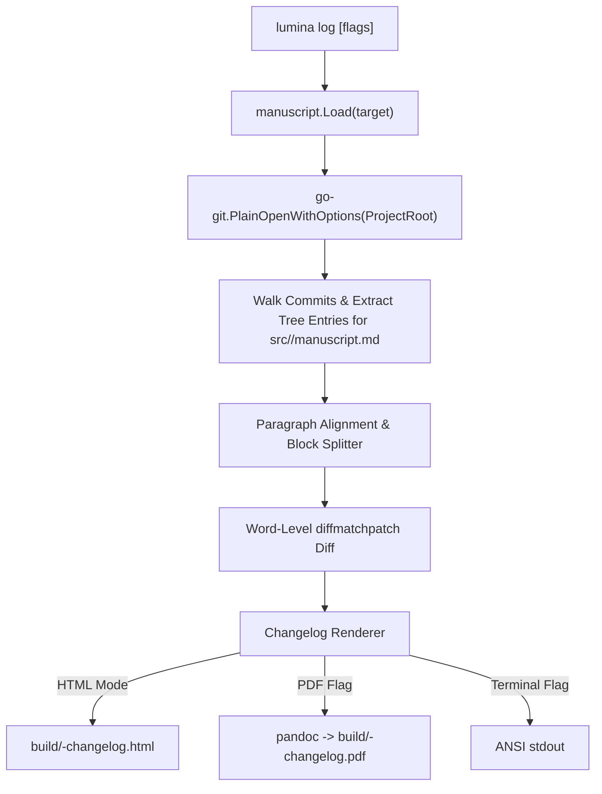

# SDD Spec: Manuscript Evolution Changelog

## Metadata

* **Status:** `COMPLETED`
* **Author:** Konstantin Sharlaimov / Agent
* **Created:** 2026-09-23
* **Last Updated:** 2026-09-23
* **Approver:** Konstantin Sharlaimov

---

## Phase 1: Proposal (Rough Idea)

### 1.1 Problem Statement

Authors, academic advisors, and institutions often need to demonstrate genuine human creative evolution over time. Proving continuous intellectual progression (iterative drafting, conceptual expansion, paragraph-by-paragraph refinement) helps counter claims of automated whole-cloth generation or contract authorship.

Standard `git log` and `git diff` operate across an entire codebase (configs, figures, bibliography, scripts) and present raw patch hunks (`@@ -12,4 +12,6 @@`) that are difficult to review visually as continuous academic prose. Authors need a dedicated tool to inspect how a manuscript's text specifically evolved over its Git history, presented as rich, visual, paragraph-level comparisons.

### 1.2 Proposed Solution

Introduce `lumina log <target>`: a top-level command that inspects the Git history of a specific target's manuscript text (`src/<target>/manuscript.md`).

Key capabilities:
1. **Target-Isolated Git Prose History**: Focuses exclusively on `src/<target>/manuscript.md`, filtering out unrelated repository commits and non-prose asset changes.
2. **Paragraph-Level Colored Diff & Formatted Citations**: Identifies added, deleted, and modified paragraphs across revisions. For modified paragraphs, computes word-level diffs with deleted words struck through in red (`<del>`) and added words highlighted in green (`<ins>`). Detects bibliography changes in `src/<target>/references.bib` and renders them as formatted academic citations (`Author (Year). "Title". Source.`).
3. **Visual Representation (HTML, Markdown & PDF)**: Generates a standalone, beautifully styled HTML document (`build/<stem>-changelog.html`) with an evolution dashboard, sticky quick-links navigation line, and chronological revision cards. Optionally exports to Markdown (`--markdown` / `--md`) or PDF (`--pdf`) via Pandoc.
4. **Terminal View**: Supports direct command-line inspection (`--terminal` / `-t`) with ANSI strikethrough and colored highlights.
5. **Chronological Order & Total Duration**: Displays revisions progressing chronologically from first commit to last, calculating total elapsed writing duration.
6. **Flexible Filtering**: Allows filtering by commit count (`-n` / `--max-count`) and commit range / timeframe (`--since`).

### 1.3 Scope & Requirements

* **In Scope:**
  * Package `internal/changelog` for Git commit extraction, paragraph block parsing, word diff computation, citation formatting, and HTML/Markdown/ANSI rendering.
  * Command `lumina log <target>` wired into Cobra root command.
  * Flags:
    * `--output`, `-o <path>`: Custom output path (defaults to `build/<stem>-changelog.html`).
    * `--markdown`, `--md`, `-m`: Export changelog to Markdown (`build/<stem>-changelog.md`).
    * `--pdf`: Compile changelog to PDF (`build/<stem>-changelog.pdf`).
    * `--terminal`, `-t`: Output colored diff directly to terminal stdout (or markdown when combined with `--markdown`).
    * `--stat`: Display summary statistics (+words, -words, commit message) without paragraph diffs.
    * `--since <string>`: Filter commits (e.g. `--since="2026-01-01"`, `--since=v1.0`).
    * `-n`, `--max-count <int>`: Limit to the last $N$ manuscript-touching commits.
  * Native Go Git integration via `github.com/go-git/go-git/v5` (no external `git` binary required).
  * Word-level diffing via `github.com/sergi/go-diff/diffmatchpatch`.
  * Unit tests with synthetic in-memory or temporary Git repository test fixtures.
* **Out of Scope:**
  * Interactive web GUI / server (handled in Spec 005).
  * Tracking binary figure diffs or external bibliography changes.

---

## Phase 2: System Design (SDD)

### 2.1 Architecture & Components



### 2.2 Data Structures & Interfaces

```go
package changelog

import "time"

// DiffType specifies whether a block or word was added, deleted, modified, or unchanged.
type DiffType int

const (
    DiffUnchanged DiffType = iota
    DiffAdded
    DiffDeleted
    DiffModified
)

// WordSpan represents a word or punctuation token in a diff.
type WordSpan struct {
    Type DiffType
    Text string
}

// ParagraphDiff represents a single paragraph or heading comparison between two revisions.
type ParagraphDiff struct {
    Type          DiffType
    HeaderLevel   int        // > 0 if heading (e.g. 1 for #, 2 for ##)
    OriginalText  string
    CurrentText   string
    Spans         []WordSpan // Word-level diff tokens for modified paragraphs
}

// Revision represents a single Git commit touching the manuscript.
type Revision struct {
    Hash         string
    ShortHash    string
    Author       string
    Email        string
    Date         time.Time
    Subject      string
    Body         string
    WordsAdded   int
    WordsDeleted int
    NetWords     int
    TotalWords   int
    Diffs        []ParagraphDiff
}

// Changelog represents the complete revision history for a manuscript target.
type Changelog struct {
    Target       string
    Title        string
    ManuscriptPath string
    Revisions    []Revision
    TotalCommits int
    TotalAdded   int
    TotalDeleted int
}
```

### 2.3 Protocol & CLI Changes

Command signature:
```
lumina log <target> [flags]
```

Flags:
* `-o, --output <path>`: Custom output filename (default: `build/<stem>-changelog.html`).
* `--pdf`: Build PDF output artifact `build/<stem>-changelog.pdf`.
* `-t, --terminal`: Print colored ANSI diff to stdout.
* `--stat`: Print summary statistics table instead of full paragraph diffs.
* `--since <string>`: Filter commits by date or Git revision range.
* `-n, --max-count <int>`: Analyze only the most recent $N$ revisions.

HTML Styling:
* Modern typography with CSS variables.
* Red strikethrough for deleted text:
  ```css
  del {
      background-color: #ffebe9;
      color: #cf222e;
      text-decoration: line-through;
      padding: 0.1em 0.2em;
      border-radius: 3px;
  }
  ```
* Green highlight for added text:
  ```css
  ins {
      background-color: #dafbe1;
      color: #1a7f37;
      text-decoration: none;
      font-weight: 500;
      padding: 0.1em 0.2em;
      border-radius: 3px;
  }
  ```

---

## Phase 3: Implementation Plan (IP)

### 3.1 Task Breakdown

- [x] **Task 1: Package `internal/changelog` - Git Extraction & Word Diff**
  - Implement Git history extraction via `go-git/v5`.
  - Implement paragraph block parsing.
  - Implement word-level LCS / Myers diff algorithm with `diffmatchpatch`.
  - Files: `internal/changelog/diff.go`, `internal/changelog/git.go`, `internal/changelog/types.go`.
  - Verification: `go test ./internal/changelog/...`

- [x] **Task 2: Package `internal/changelog` - Renderers (HTML, Terminal, PDF)**
  - Implement HTML template rendering with responsive CSS and `<del>` / `<ins>` styling.
  - Implement ANSI terminal renderer.
  - Implement PDF export via Pandoc runner.
  - Files: `internal/changelog/html.go`, `internal/changelog/terminal.go`, `internal/changelog/pdf.go`.
  - Verification: `go test ./internal/changelog/...`

- [x] **Task 3: Top-Level CLI Command `lumina log <target>`**
  - Create `cmd/log.go` and wire into `cmd/root.go`.
  - Add flags: `--output`, `--pdf`, `--terminal`, `--stat`, `--since`, `--max-count`.
  - Register under `"manuscript"` command group.
  - Files: `cmd/log.go`, `cmd/root.go`.
  - Verification: `go test ./cmd/...`

- [x] **Task 4: Update Documentation & Spec Index**
  - Update `spec/README.md`.
  - Update `AGENTS.md` and `README.md`.
  - Verification: `make test && make vet && make build`

### 3.2 Risks & Mitigation

* **Risk:** Extremely large repositories or commits causing high memory consumption during diffing.
  * **Mitigation:** Stream commit extraction, limit diff comparisons to adjacent commits for `src/<target>/manuscript.md` only.
* **Risk:** Git repository not detected or running in a directory without Git.
  * **Mitigation:** Clear error message instructing the user that `lumina log` requires a Git repository.

---

## Phase 4: Execution & Verification

- [x] All per-task verification steps pass.
- [x] Linter / vet clean.
- [x] Unit tests pass.
- [x] Build targets compile.
- [x] Neighbor packages unaffected.
- [x] Approved by the User.

---

## Phase 5: Completed

- [x] All Phase 4 items `[x]`.
- [x] No regressions.
- [x] Spec document reflects actual implementation.
- [x] `spec/README.md` updated to `COMPLETED`.
- [x] Approved by the User.
